<div class="MCWHeader1">
Azure Synapse Analytics end-to-end solution
</div>

<div class="MCWHeader2">
Hands-on lab step-by-step
</div>

<div class="MCWHeader3">
May 2020
</div>


Information in this document, including URL and other Internet Web site references, is subject to change without notice. Unless otherwise noted, the example companies, organizations, products, domain names, e-mail addresses, logos, people, places, and events depicted herein are fictitious, and no association with any real company, organization, product, domain name, e-mail address, logo, person, place or event is intended or should be inferred. Complying with all applicable copyright laws is the responsibility of the user. Without limiting the rights under copyright, no part of this document may be reproduced, stored in or introduced into a retrieval system, or transmitted in any form or by any means (electronic, mechanical, photocopying, recording, or otherwise), or for any purpose, without the express written permission of Microsoft Corporation.

Microsoft may have patents, patent applications, trademarks, copyrights, or other intellectual property rights covering subject matter in this document. Except as expressly provided in any written license agreement from Microsoft, the furnishing of this document does not give you any license to these patents, trademarks, copyrights, or other intellectual property.

The names of manufacturers, products, or URLs are provided for informational purposes only and Microsoft makes no representations and warranties, either expressed, implied, or statutory, regarding these manufacturers or the use of the products with any Microsoft technologies. The inclusion of a manufacturer or product does not imply endorsement of Microsoft of the manufacturer or product. Links may be provided to third party sites. Such sites are not under the control of Microsoft and Microsoft is not responsible for the contents of any linked site or any link contained in a linked site, or any changes or updates to such sites. Microsoft is not responsible for webcasting or any other form of transmission received from any linked site. Microsoft is providing these links to you only as a convenience, and the inclusion of any link does not imply endorsement of Microsoft of the site or the products contained therein.

© 2020 Microsoft Corporation. All rights reserved.

Microsoft and the trademarks listed at <https://www.microsoft.com/en-us/legal/intellectualproperty/Trademarks/Usage/General.aspx> are trademarks of the Microsoft group of companies. All other trademarks are property of their respective owners.

**Contents** 

<!-- TOC -->
- [Azure Synapse Analytics end-to-end solution hands-on lab step-by-step](#azure-synapse-analytics-end-to-end-solution-hands-on-lab-step-by-step)
  - [Abstract and learning objectives](#abstract-and-learning-objectives)
  - [Overview](#overview)
  - [Solution architecture](#solution-architecture)
  - [Requirements](#requirements)
  - [Before the hands-on lab](#before-the-hands-on-lab)
  - [Resource naming throughout this lab](#resource-naming-throughout-this-lab)
  - [Exercise 1: Accessing the Azure Synapse Analytics workspace](#exercise-1-accessing-the-azure-synapse-analytics-workspace)
    - [Task 1: Launching Synapse Studio](#task-1-launching-synapse-studio)
  - [Exercise 2: Create and populate the supporting tables in the SQL Pool](#exercise-2-create-and-populate-the-supporting-tables-in-the-sql-pool)
    - [Task 1: Create the customer information table](#task-1-create-the-customer-information-table)
    - [Task 2: Populate the customer information table](#task-2-populate-the-customer-information-table)
    - [Task 3: Create the campaign analytics table](#task-3-create-the-campaign-analytics-table)
    - [Task 4: Populate the campaign analytics table](#task-4-populate-the-campaign-analytics-table)
    - [Task 5: Create the sale table](#task-5-create-the-sale-table)
    - [Task 6: Populate the sale table](#task-6-populate-the-sale-table)
    - [Task 7: Populate the product table](#task-7-populate-the-product-table)
  - [Exercise 3: Exploring raw parquet data](#exercise-3-exploring-raw-parquet-data)
    - [Task 1: Query sales Parquet data with Synapse SQL Serverless](#task-1-query-sales-parquet-data-with-synapse-sql-serverless)
    - [Task 2: Query sales Parquet data with Azure Synapse Spark](#task-2-query-sales-parquet-data-with-azure-synapse-spark)
  - [Exercise 4: Exploring raw text based data with Azure Synapse SQL Serverless](#exercise-4-exploring-raw-text-based-data-with-azure-synapse-sql-serverless)
    - [Task 1: Query CSV data](#task-1-query-csv-data)
    - [Task 2: Query JSON data](#task-2-query-json-data)
  - [Exercise 5: Security](#exercise-5-security)
    - [Task 1: Column level security](#task-1-column-level-security)
    - [Task 2: Row level security](#task-2-row-level-security)
    - [Task 3: Dynamic data masking](#task-3-dynamic-data-masking)
  - [Exercise 6: Machine Learning](#exercise-6-machine-learning)
    - [Task 1: Training models](#task-1-training-models)
    - [Task 2: Registering the models with Azure Synapse Analytics](#task-2-registering-the-models-with-azure-synapse-analytics)
    - [Task 3: Making predictions with the registered models](#task-3-making-predictions-with-the-registered-models)
  - [Exercise 7: Monitoring](#exercise-7-monitoring)
    - [Task 1: Workload Importance](#task-1-workload-importance)
    - [Task 2: Workload Isolation](#task-2-workload-isolation)
    - [Task 3: Monitoring with Dynamic Management Views](#task-3-monitoring-with-dynamic-management-views)
    - [Task 4: Orchestration Monitoring with the Monitor Hub](#task-4-orchestration-monitoring-with-the-monitor-hub)
    - [Task 5: Monitoring SQL Requests with the Monitor Hub](#task-5-monitoring-sql-requests-with-the-monitor-hub)
  - [After the hands-on lab](#after-the-hands-on-lab)
    - [Task 1: Delete the resource group](#task-1-delete-the-resource-group)
<!-- /TOC -->

# Azure Synapse Analytics end-to-end solution hands-on lab step-by-step

## Abstract and learning objectives

In this hands-on-lab, you will build an end-to-end data analytics with machine learning solution using Azure Synapse Analytics. The information will be presented in the context of a retail scenario. We will be heavily leveraging Azure Synapse Studio, a tool that conveniently unifies the most common data operations from ingestion, transformation, querying, and visualization.

## Overview

In this lab various features of Azure Synapse Analytics will be explored. Azure Synapse Analytics Studio is a single tool that every team member can use collaboratively. Synapse Studio will be the only tool used throughout this lab through data ingestion, cleaning, and transforming raw files to using Notebooks to train, register, and consume a Machine learning model. The lab will also provide hands-on-experience monitoring and prioritizing data related workloads.

## Solution architecture


This lab explores the cold data scenario of ingesting various types of raw data files. These files can exist anywhere. The file types used in this lab are CSV, parquet, and JSON. This data will be ingested into Synapse Analytics via Pipelines. From there, the data can be transformed and enriched using various tools such as data flows, Synapse Spark, and Synapse SQL (both provisioned and serverless). Once processed, data can be queried using Synapse SQL tooling. Azure Synapse Studio also provides the ability to author notebooks to further process data, create datasets, train, and create machine learning models. These models can then be stored in a storage account or even in a SQL table. These models can then be consumed via various methods, including T-SQL. The foundational component supporting all aspects of Azure Synapse Analytics is the ADLS Gen 2 Data Lake.

## Requirements

1. Microsoft Azure subscription

2. Azure Synapse Workspace / Studio

## Before the hands-on lab

Refer to the Before the hands-on lab setup guide manual before continuing to the lab exercises.

## Resource naming throughout this lab

For the remainder of this lab, the following terms will be used for various ASA (Azure Synapse Analytics) related resources (make sure you replace them with actual names and values from your environment):

| Azure Synapse Analytics Resource  | To be referred to                                                                  |
|-----------------------------------|------------------------------------------------------------------------------------|
| Azure Subscription                | `WorkspaceSubscription`                                                            |
| Azure Region                      | `WorkspaceRegion`                                                                  |
| Workspace resource group          | `WorkspaceResourceGroup`                                                           |
| Workspace / workspace name        | `Workspace`                                                                        |
| Primary Storage Account           | `PrimaryStorage`                                                                   |
| Default file system container     | `DefaultFileSystem`                                                                |
| SQL Pool                          | `SqlPool01`                                                                        |
| SQL Serverless Endpoint           | `SqlServerless01`                                                                  |
| Azure Key Vault                   | `KeyVault01`                                                                       |

## Exercise 1: Accessing the Azure Synapse Analytics workspace

All exercises in this lab utilize the workspace Synapse Studio user interface. This exercise will outline the steps to launch Synapse Studio. Unless otherwise specified, all instruction including menu navigation will occur in Synapse Studio.

### Task 1: Launching Synapse Studio

1. Log into the [Azure Portal](https://portal.azure.com).

2. Expand the left menu, and select the **Resource groups** item.
  
    

3. From the list of resource groups, select `WorkspaceResourceGroup`.
  
4. From the list of resources, select the **Synapse Workspace** resource, `Workspace`.
  
    

5. On the **Overview** tab of the Synapse Workspace page, select the **Launch Synapse Studio** item from the top toolbar. Alternatively you can select the Workspace web URL link.

    

## Exercise 2: Create and populate the supporting tables in the SQL Pool

The first step in querying meaningful data is to create tables to house the data. In this case, we will create two different tables: CustomerInfo and Sales. When designing tables in Azure Synapse Analytics, we need to take into account the expected amount of data in each table, as well as how each table will be used. Utilize the following guidance when designing your tables to ensure the best experience and performance.

Table design performance considerations

| Table Indexing | Recommended use |
|--------------|-------------|
| Clustered Columnstore | recommended for tables with greater than 100 million rows, offers the highest data compression with best overall query performance |
| Heap Tables | Smaller tables with less than 100 million rows, commonly used as a staging table prior to transformation |
| Clustered Index | large lookup tables (> 100 million rows) where querying will only result in a single row returned |
| Clustered Index + non-clustered secondary index | large tables (> 100 million rows) when single (or very few) records are being returned in queries |

| Table Distribution/Partition Type | Recommended use |
|--------------------|-------------|
| Hash distribution | tables that are larger than 2 GBs with infrequent insert/update/delete operations, works well for large fact tables in a star schema |
| Round robin distribution | default distribution, when little is known about the data or how it will be used. Use this distribution for staging tables |
| Replicated tables | smaller lookup tables less than 1.5 GB in size |

### Task 1: Create the customer information table

Over the past 5 years, Wide World Importers has amassed over 3 billion rows of sales data. With this quantity of data, the customer information lookup table is estimated to have over 100 million rows but will consume less than 1.5 GB of storage. While we will be using only a subset of this data for the lab, we will design the table for the production environment. Using the guidance outlined in the Exercising description, we can ascertain that we will need a **Clustered Columnstore** table with a **Replicated** table distribution to hold customer data.

1. Expand the left menu and select the **Develop** item. From the **Develop** blade, expand the **+** button and select the **SQL script** item.

    

2. In the query tab toolbar menu, ensure you connect to your SQL Pool, `SQLPool01`.

    

3. In the query window, copy and paste the following query to create the customer information table. Then select the **Run** button in the query tab toolbar.
  
   ```sql
    CREATE TABLE [wwi_mcw].[CustomerInfo]
    (
      [UserName] [nvarchar](100)  NULL,
      [Gender] [nvarchar](10)  NULL,
      [Phone] [nvarchar](50)  NULL,
      [Email] [nvarchar](150)  NULL,
      [CreditCard] [nvarchar](21)  NULL
    )
    WITH
    (
      DISTRIBUTION = REPLICATE,
      CLUSTERED COLUMNSTORE INDEX
    )
    GO
   ```

   

4. From the top toolbar, select the **Discard all** button as we will not be saving this query. When prompted, choose to **Discard all changes**.

   

### Task 2: Populate the customer information table

1. The data that we will be retrieving to populate the customer information table is currently stored in CSV format in a public blob storage container. The storage account that possesses this data has already been added as a linked service in Azure Synapse Analytics when the environment was provisioned.  Linked Services are synonymous with connection strings in Azure Synapse Analytics. Azure Synapse Analytics linked services provides the ability to connect to nearly 100 different types of external services ranging from Azure Storage Accounts to Amazon S3 and more. Review the presence of the **solliancepublicdata** linked service, by selecting **Manage** from the left menu, and selecting **Linked services** from the blade menu. Filter the linked services by the term **solliance** to find the **solliancepublicdata** item. Further investigating this item will unveil that it makes a connection to the storage account using a storage account key.
  
   

2. Similar to the previous step, the destination for our data has also been added as a linked service. In this case, the destination for our data is our SQL Pool, `SQLPool01`. Repeat the previous step, this time filtering with the term **sqlpool** to verify the existence of the linked service.

3. The next thing that we will need to do is define a source dataset that will represent the information that we are copying over. This dataset will reference the CSV file containing customer information. From the left menu, select **Data**. From the **Data** blade, expand the **+** button and select **Dataset**.

    

4. On the **New dataset** blade, with the **All** tab selected, choose the **Azure Blob Storage** item. Select **Continue**.  
  
    

5. On the **Select format** blade, select **CSV Delimited Text**. Select **Continue**.

    

6. On the **Set properties** blade, set the fields to the following values, then select **OK**.

   | Field | Value |
   |-------|-------|
   | Name  | Enter **asamcw_customerinfo_csv** |
   | Linked service | Select **solliancepublicdata**.|
   | File Path - Container | Enter **wwi-02** |
   | File Path - Directory | Enter **customer-info** |
   | File Path - File | Enter **customerinfo.csv** |
   | First row as header | Checked |
   | Import schema | Select **From connection/store** |

    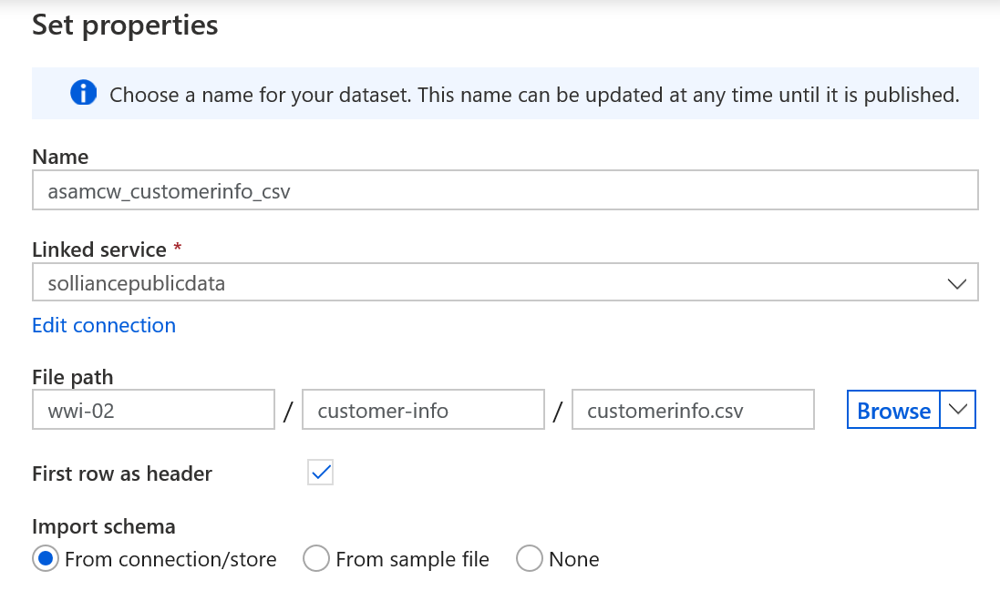

7. Now we will need to define the destination dataset for our data. In this case we will be storing customer information data in our SQL Pool. On the **Data** blade, expand the **+** button just as you did in **Step 3**.

8. On the **New dataset** blade, with the **Azure** tab selected, enter **synapse** as a search term and select the **Azure Synapse Analytics (formerly SQL DW)** item. Select **Continue**.

    
  
9. On the **Set properties** blade, set the field values to the following, then select **OK**.

   | Field | Value |
   |-------|-------|
   | Name  | Enter **asamcw_customerinfo_asa** |
   | Linked service | Select `SQLPool01`. |
   | Table name | Select **wwi_mcw.CustomerInfo**. |  
   | Import schema | Select **From connection/store** |

    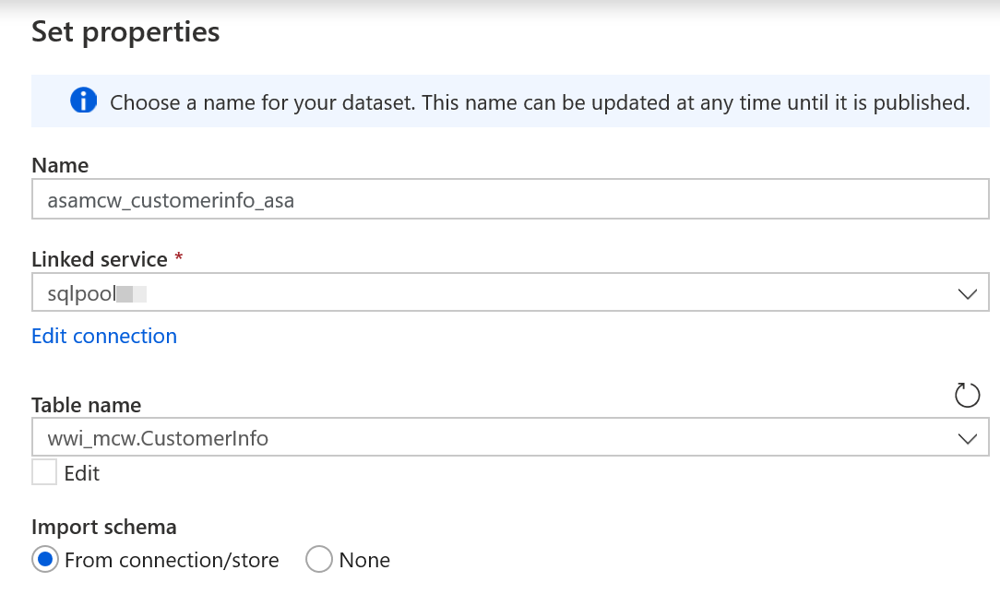
  
10. In the top toolbar, select **Publish all** to publish the new dataset definitions. When prompted, select the **Publish** button to commit the changes.

    

11. Next, we will define a pipeline to populate data into the CustomerInfo table. From the left menu, select **Orchestrate**. From the Orchestrate blade, select the **+** button and select the **Pipeline** item.

    

12. In the bottom pane, on the **General** tab, enter **ASAMCW - Exercise 2 - Copy Customer Information** in the **Name** field.

    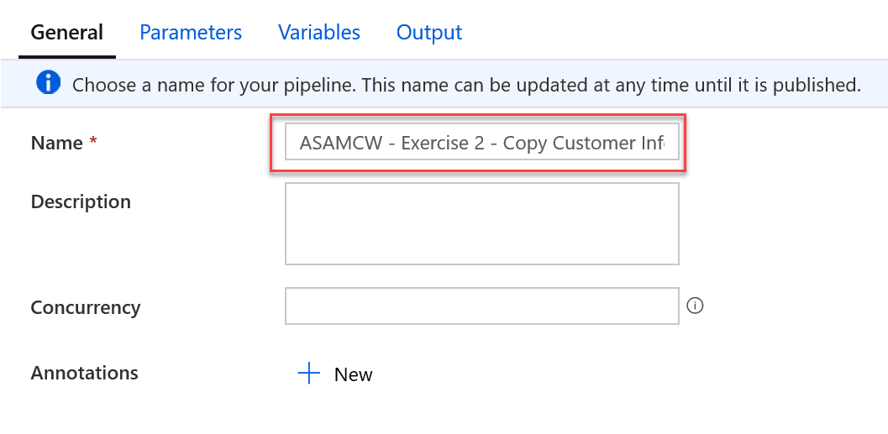

13. In the **Activities** menu, expand the **Move & transform** item. Drag an instance of the **Copy data** activity to the design surface of the pipeline.

    

14. Select the **Copy data** activity on the pipeline design surface. In the bottom pane, on the **General** tab, enter **Copy Customer Information Data** in the **Name** field.

    

15. Select the **Source** tab in the bottom pane. In the **Source dataset** field, select **asamcw_customerinfo_csv**.

    
  
16. Select the **Sink** tab in the bottom pane. In the **Sink dataset** field, select **asamcw_customerinfo_asa**, for the **Copy method** field, select **Bulk insert**, and for **Pre-copy script** enter:

    ```sql
      truncate table wwi_mcw.CustomerInfo
    ```

    
  
17. Select the **Mapping** tab in the bottom pane. Select the **Import schemas** button. You will notice that Azure Synapse Analytics automated the mapping for us since the field names and types match.

    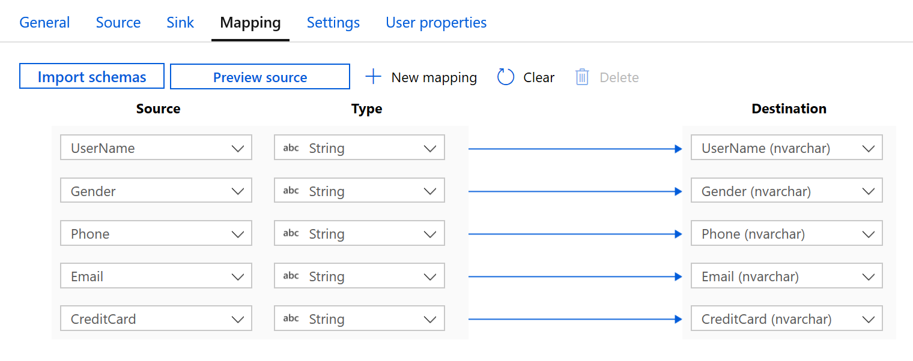

18. In the top toolbar, select **Publish all** to publish the new dataset definitions. When prompted, select the **Publish** button to commit the changes.

    

19. Once published, expand the **Add trigger** item on the pipeline designer toolbar, and select **Trigger now**. In the **Pipeline run** blade, select **OK** to proceed with the latest published configuration. You will see notification toast windows indicating the pipeline is running and when it has completed.

20. View the status of the completed run by locating the **ASAMCW - Exercise 2 - Copy Customer Information** pipeline in the Orchestrate blade. Expand the actions menu, and select the **Monitor** item.

    
  
21. You should see a successful run of the pipeline we created in the **Pipeline runs** table.
  
    

22. Verify the table has populated by creating a new query. Remember from **Task 1**, select the **Develop** item from the left menu, and in the **Develop** blade, expand the **+** button, and select **SQL script**. In the query window, be sure to connect to the SQL Pool database (`SQLPool01`), then paste and run the following query. When complete, select the **Discard all** button from the top toolbar.

  ```sql
    select * from wwi_mcw.CustomerInfo;
  ```
  
### Task 3: Create the campaign analytics table

The campaign analytics table will be queried primarily for dashboard and KPI purposes. Performance is a large factor in the design of this table, and as such  we can ascertain that we will need a **Clustered Columnstore** table with a **Hash** table distribution based on the **Region** field which will fairly evenly distribute the data.

1. Expand the left menu and select the **Develop** item. From the **Develop** blade, expand the **+** button and select the **SQL script** item.

    

2. In the query tab toolbar menu, ensure you connect to your SQL Pool, `SQLPool01`.

    

3. In the query window, copy and paste the following query to create the customer information table. Then select the **Run** button in the query tab toolbar.

    ```sql
    CREATE TABLE [wwi_mcw].[CampaignAnalytics]
    (
        [Region] [nvarchar](50)  NOT NULL,
        [Country] [nvarchar](30)  NOT NULL,
        [ProductCategory] [nvarchar](50)  NOT NULL,
        [CampaignName] [nvarchar](500)  NOT NULL,
        [Analyst] [nvarchar](25) NULL,
        [Revenue] [decimal](10,2)  NULL,
        [RevenueTarget] [decimal](10,2)  NULL,
        [City] [nvarchar](50)  NULL,
        [State] [nvarchar](25)  NULL
    )
    WITH
    (
        DISTRIBUTION = HASH ( [Region] ),
        CLUSTERED COLUMNSTORE INDEX
    );  
    ```

    

4. From the top toolbar, select the **Discard all** button as we will not be saving this query. When prompted, choose to **Discard all changes**.

   

### Task 4: Populate the campaign analytics table

Similar to the customer information table, we will also be populating the campaign analytics table via a CSV file located in the public storage account. This will require source and sink datasets to point to the CSV file in storage and the campaign analytics table that you just created in the SQL Pool. The source CSV file that was received is poorly formatted - we will need to add data transformations to make adjustments to this data before it is imported into the data warehouse.

1. The source dataset will reference the CSV file containing campaign analytics information. From the left menu, select **Data**. From the **Data** blade, expand the **+** button and select **Dataset**.

    

2. On the **New dataset** blade, with the **All** tab selected, choose the **Azure Blob Storage** item. Select **Continue**.  
  
    

3. On the **Select format** blade, select **CSV Delimited Text**. Select **Continue**.

    

4. On the **Set properties** blade, set the fields to the following values, then select **OK**. You may choose to preview the data which will show a sample of the CSV file. Notice that since we are not setting the first row as the header, the header columns appear as the first row. Also, notice that the city and state values do not appear. This is because of the mismatch in the number of columns in the header row compared to the rest of the file. Soon, we will exclude the first row as we transform the data.

   | Field | Value |
   |-------|-------|
   | Name  | Enter **asamcw_campaignanalytics_csv** |
   | Linked service | Select **solliancepublicdata**.|
   | File Path - Container | Enter **wwi-02** |
   | File Path - Directory | Enter **campaign-analytics** |
   | File Path - File | Enter **campaignanalytics.csv** |
   | First row as header | Unchecked |
   | Import schema | Select **From connection/store** |

    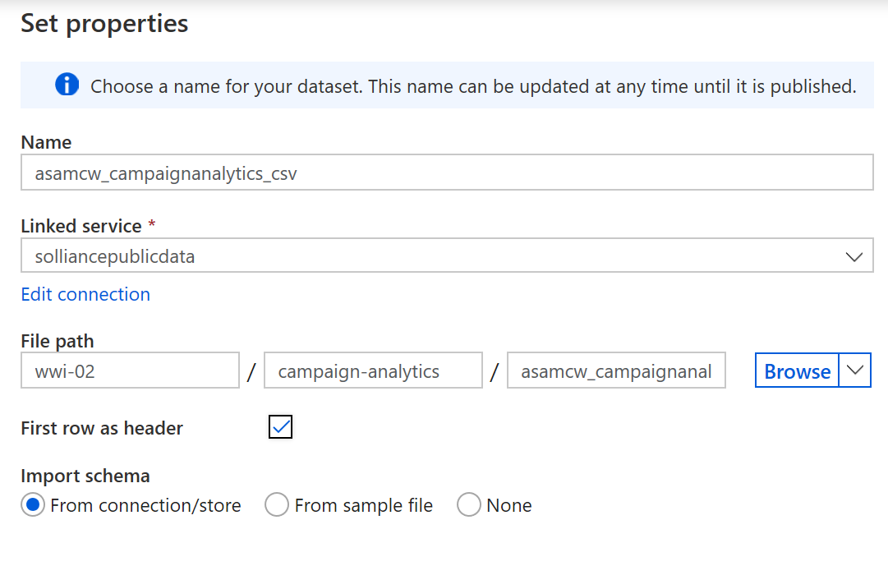

5. Now we will need to define the destination dataset for our data. In this case we will be storing campaign analytics data in our SQL Pool. On the **Data** blade, expand the **+** button and select **Dataset**.

6. On the **New dataset** blade, with the **Azure** tab selected, enter **synapse** as a search term and select the **Azure Synapse Analytics (formerly SQL DW)** item. Select **Continue**.

    
  
7. On the **Set properties** blade, set the field values to the following, then select **OK**.

   | Field | Value |
   |-------|-------|
   | Name  | Enter **asamcw_campaignanalytics_asa** |
   | Linked service | Select `SQLPool01`. |
   | Table name | Select **wwi_mcw.CampaignAnalytics**. |  
   | Import schema | Select **From connection/store** |

    
  
8. In the top toolbar, select **Publish all** to publish the new dataset definitions. When prompted, select the **Publish** button to commit the changes.

    

9. Since our source data is malformed and does not contain an Analyst column, we will need to create a data flow to transform the source data. A data flow allows you to graphically define dataset filters and transformations without writing code. These data flows can be leveraged as an activity in an orchestration pipeline. Create a new data flow, start by selecting **Develop** from the left menu, and in the **Develop** blade, expand the **+** button and select **Data flow**.

    

10. Select the Properties icon on the right side of the dataflow designer toolbar. In the **Properties** blade name the data flow by entering **ASAMCW - Exercise 2 - Campaign Analytics Data** in the **Name** field.

    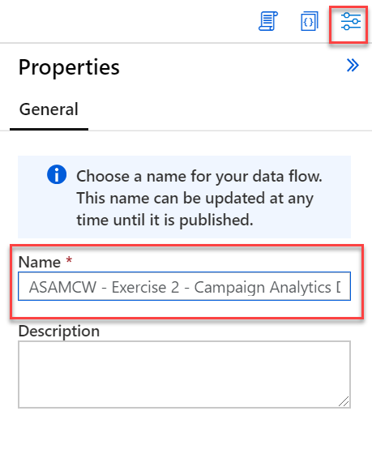

11. In the data flow designer window, select the **Add Source** box.

    

12. Under **Source settings**, configure the following:

    | Field | Value |
    |-------|-------|
    | Output stream name  | Enter **campaignanlyticscsv** |
    | Dataset | Select **asamcw_campaignanalytics_csv**. |
    | Skip line count | Enter **1** |  

    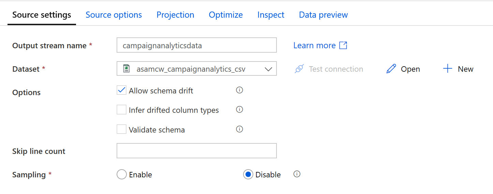

13. When you create data flows, certain features are enabled by turning on debug, such as previewing data and importing a schema (projection). Due to the amount of time it takes to enable this option, as well as environmental constraints of the lab environment, we will bypass these features. The data source has a schema we need to set. To do this, select **Script** from the right side of the dataflow designer toolbar menu.

    

14. Replace the script with the following to provide the column mappings (`output`), then select **OK**:

    ```json
        source(output(
            {_col0_} as string,
            {_col1_} as string,
            {_col2_} as string,
            {_col3_} as string,
            {_col4_} as string,
            {_col5_} as double,
            {_col6_} as string,
            {_col7_} as double,
            {_col8_} as string,
            {_col9_} as string
        ),
        allowSchemaDrift: true,
        validateSchema: false,
        skipLines: 1) ~> campaignanalyticscsv
    ```

15. Select the **campaignanalyticscsv** data source, then select **Projection**. The projection should display the following schema:

    

16. Select the **+** to the bottom right of the **campaignanalyticscsv** source, then select the **Select** schema modifier from the context menu.

    

17. In the bottom pane, under **Select settings**, configure the following:

    | Field | Value |
    |-------|-------|
    | Output stream name  | Enter **mapcampaignanlytics** |

    For **Input Columns**, under the **Name as** column, enter the following list values in order:
      - Region
      - Country
      - ProductCategory
      - CampaignName
      - RevenuePart1
      - Revenue
      - RevenueTargetPart1
      - RevenueTarget
      - City
      - State

    

18. Select the **+** to the right of the **mapCampaignAnalytics** source, then select the **Derived Column** schema modifier from the context menu.

19. Under **Derived column's settings**, configure the following:

    | Field | Value |
    |-------|-------|
    | Output stream name  | Enter **convertandaddcolums** |

    For **Columns**, add the following (Note you will need to type in the **Analyst** column):

    | Column | Expression | Description |
    | --- | --- | --- |
    | Revenue | **toDecimal(replace(concat(toString(RevenuePart1), toString(Revenue)), '\\', ''), 10, 2, '$###,###.##')** | Concatenate the **RevenuePart1** and **Revenue** fields, replace the invalid `\` character, then convert and format the data to a decimal type. |
    | RevenueTarget | **toDecimal(replace(concat(toString(RevenueTargetPart1), toString(RevenueTarget)), '\\', ''), 10, 2, '$###,###.##')** | Concatenate the **RevenueTargetPart1** and **RevenueTarget** fields, replace the invalid `\` character, then convert and format the data to a decimal type. |
    | Analyst | **iif(isNull(City), '',  replace('DataAnalyst'+ City,' ',''))** | If the city field is null, assign an empty string to the Analyst field, otherwise concatenate DataAnalyst to the City value, removing all spaces. |

    

20. Select the **+** to the right of the **convertandaddcolumns** step, then select the **Select** schema modifier from the context menu.

21. Under **Select settings**, configure the following:

    | Field | Value |
    |-------|-------|
    | Output stream name  | Enter **selectcampaignanalyticscolumns** |
    | Input columns | Delete the **RevenuePart1** and **RevenueTargetPart1** columns |

    

22. Select the **+** to the right of the **selectcampaignanalyticscolumns** step, then select the **Sink** destination from the context menu.

23. In the bottom pane, on the **Sink** tab, configure it as follows:

    | Field | Value |
    |-------|-------|
    | Output stream name  | Enter **campaignanlyticsasa** |
    | Dataset | Select **asamcw_campaignanalytics_asa**. |

    

24. Select **Settings** tab, and for **Table action** select **Truncate table**.

    

25. Your completed data flow should look similar to the following:

    
  
26. Select **Publish all** to save your new data flow.

    

27. Now that the data flow is published, we can use it in a pipeline. Create a new pipeline by selecting **Orchestrate** from the left menu, then in the **Orchestrate** blade, expand the **+** button and select **Pipeline**.

28. Expand the **Properties** pane on the right side of the pipeline designer. Enter **ASAMCW - Exercise 2 - Copy Campaign Analytics Data** in the **Name** field.

    

29. From the **Activities** menu, expand the **Move & transform** section and drag an instance of **Data flow** to the design surface of the pipeline.
  
    

30. In the **Adding data flow** blade, select the data flow **ASAMCW - Exercise 2 - Campaign Analytics Data**, then **Finish**. Select the Mapping Data Flow activity on the design surface.

31. In the bottom pane, select the **Settings** tab and set the form fields to the following values:

    | Field | Value |
    |-------|-------|
    | Data flow  | Select **ASAMCW - Exercise 2 - Campaign Analytics Data** |
    | Staging linked service | Select `PrimaryStorage`. |
    | Staging storage folder - Container | Enter **staging** |
    | Staging storage folder - Folder | Enter **mcwcampaignanalytics** |

    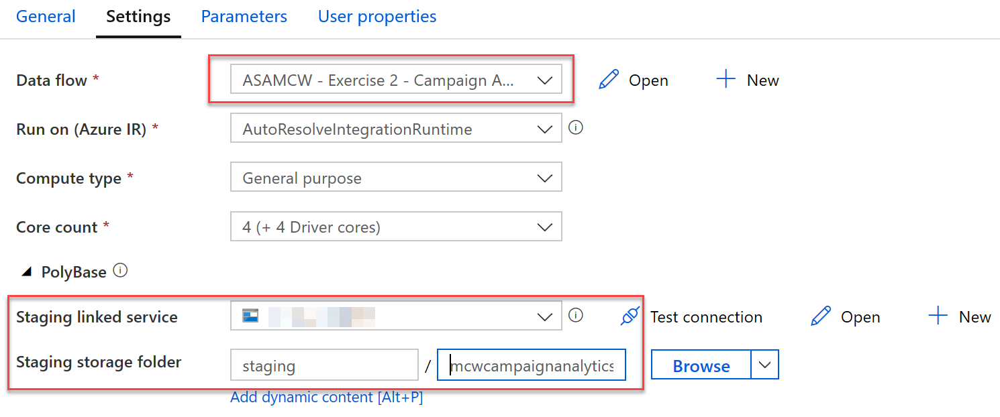

32. In the top toolbar, select **Publish all** to publish the new pipeline. When prompted, select the **Publish** button to commit the changes.

    

33. Once published, expand the **Add trigger** item on the pipeline designer toolbar, and select **Trigger now**. In the **Pipeline run** blade, select **OK** to proceed with the latest published configuration. You will see notification toast window indicating the pipeline is running and when it has completed.

34. View the status of the pipeline run by locating the **ASAMCW - Exercise 2 - Copy Campaign Analytics Data** pipeline in the Orchestrate blade. Expand the actions menu, and select the **Monitor** item.

    
  
35. You should see a run of the pipeline we created in the **Pipeline runs** table showing as in progress. You will need to refresh this table from time to time to see updated progress. Once it has completed. You should see the pipeline run displayed with a Status of **Succeeded**.

36. Verify the table has populated by creating a new query. Select the **Develop** item from the left menu, and in the **Develop** blade, expand the **+** button, and select **SQL script**. In the query window, be sure to connect to the SQL Pool database (`SQLPool01`), then paste and run the following query. When complete, select the **Discard all** button from the top toolbar.

  ```sql
    select count(Region) from wwi_mcw.CampaignAnalytics;
  ```

### Task 5: Create the sale table

Over the past 5 years, Wide World Importers has amassed over 3 billion rows of sales data. With this quantity of data, the storage consumed would be greater than 2 GB. While we will be using only a subset of this data for the lab, we will design the table for the production environment. Using the guidance outlined in the current Exercise description, we can ascertain that we will need a **Clustered Columnstore** table with a **Hash** table distribution based on the **CustomerId** field which will be used in most queries. For further performance gains, the table will be partitioned by transaction date to ensure queries that include dates or date arithmetic are returned in a favorable amount of time.

1. Expand the left menu and select the **Develop** item. From the **Develop** blade, expand the **+** button and select the **SQL script** item.

    

2. In the query tab toolbar menu, ensure you connect to your SQL Pool, `SQLPool01`.

    

3. In the query window, copy and paste the following query to create the customer information table. Then select the **Run** button in the query tab toolbar.

    ```sql
      CREATE TABLE [wwi_mcw].[SaleSmall]
      (
        [TransactionId] [uniqueidentifier]  NOT NULL,
        [CustomerId] [int]  NOT NULL,
        [ProductId] [smallint]  NOT NULL,
        [Quantity] [tinyint]  NOT NULL,
        [Price] [decimal](9,2)  NOT NULL,
        [TotalAmount] [decimal](9,2)  NOT NULL,
        [TransactionDateId] [int]  NOT NULL,
        [ProfitAmount] [decimal](9,2)  NOT NULL,
        [Hour] [tinyint]  NOT NULL,
        [Minute] [tinyint]  NOT NULL,
        [StoreId] [smallint]  NOT NULL
      )
      WITH
      (
        DISTRIBUTION = HASH ( [CustomerId] ),
        CLUSTERED COLUMNSTORE INDEX,
        PARTITION
        (
          [TransactionDateId] RANGE RIGHT FOR VALUES (
            20180101, 20180201, 20180301, 20180401, 20180501, 20180601, 20180701, 20180801, 20180901, 20181001, 20181101, 20181201,
            20190101, 20190201, 20190301, 20190401, 20190501, 20190601, 20190701, 20190801, 20190901, 20191001, 20191101, 20191201)
        )
      );
    ```

4. From the top toolbar, select the **Discard all** button as we will not be saving this query. When prompted, choose to **Discard all changes**.

   
  
### Task 6: Populate the sale table

The data that we will be retrieving to populate the sale table is currently stored as a series of parquet files in the **solliancepublicdata** public blob storage account. This storage account has already been added as a linked service in Azure Synapse Analytics when the environment was provisioned. The sale data for each day is stored in a separate parquet file which is placed in storage following a known convention. In this lab, we are interested in populating the Sale table with only 2018 and 2019 data.

> **Note**: The current folder structure for daily sales data is as follows: /wwi-02/sale-small/Year=`YYYY`/Quarter=`Q#`/Month=`M`/Day=`YYYYMMDD` - where `YYYY` is the 4 digit year (eg. 2019), `Q#` represents the quarter (eg. Q1), `M` represents the numerical month (eg. 1 for January) and finally `YYYYMMDD` represents a numeric date format representation (eg. `20190516` for May 16, 2019).
> A single parquet file is stored each day folder with the name **sale-small-YYYYMMDD-snappy.parquet** (replacing `YYYYMMDD` with the numeric date representation).

```text
  Sample path to the parquet folder for January 1st, 2019:
  /wwi-02/sale-small/Year=2019/Quarter=Q1/Month=1/Day=20190101/sale-small-20190101-snappy.parquet
```

1. Similar to how we've done it before, create a new Dataset by selecting **Data** from the left menu, expanding the **+** button on the Data blade and selecting **Dataset**. We will be creating a dataset that will point to the root folder of the sales data in the public storage account.

2. In the **New dataset** blade, with the **All** tab selected, choose the **Azure Blob Storage** item. Select **Continue**.

3. In the **Select format** screen, choose the **Parquet** item. Select **Continue**.

    

4. In the **Set properties** blade, populate the form as follows then select **OK**.
  
   | Field | Value |
   |-------|-------|
   | Name  | Enter **asamcw_sales_parquet** |
   | Linked service | Select **solliancepublicdata** |
   | File path - Container | Enter **wwi-02** |  
   | File path - Folder | Enter **sale-small** |
   | Import schema | Select **From connection/store** |

    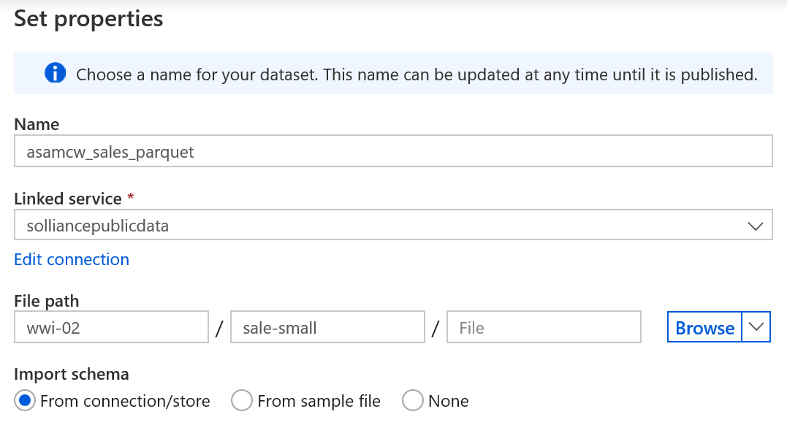

5. Now we will need to define the destination dataset for our data. In this case we will be storing sale data in our SQL Pool. Create a new dataset by expanding the **+** button on the **Data** blade and selecting **Dataset**.

6. On the **New dataset** blade, with the **Azure** tab selected, enter **synapse** as a search term and select the **Azure Synapse Analytics (formerly SQL DW)** item. Select **Continue**.
  
7. On the **Set properties** blade, set the field values to the following, then select **OK**.

   | Field | Value |
   |-------|-------|
   | Name  | Enter **asamcw_sale_asa** |
   | Linked service | Select `SQLPool01`. |
   | Table name | Select **wwi_mcw.SaleSmall**. |  
   | Import schema | Select **From connection/store** |

    
  
8. In the top toolbar, select **Publish all** to publish the new dataset definitions. When prompted, select the **Publish** button to deploy the changes to the workspace.

    

9. Since we want to filter on multiple sale year folders (Year=2018 and Year=2019) and copy only the 2018 and 2019 sales data, we will need to create a data flow to define the specific data that we wish to retrieve from our source dataset. To create a new data flow, start by selecting **Develop** from the left menu, and in the **Develop** blade, expand the **+** button and select **Data flow**.

    

10. In the lower pane on the **General** tab, name the data flow by entering **ASAMCW - Exercise 2 - 2018 and 2019 Sales** in the **Name** field.

    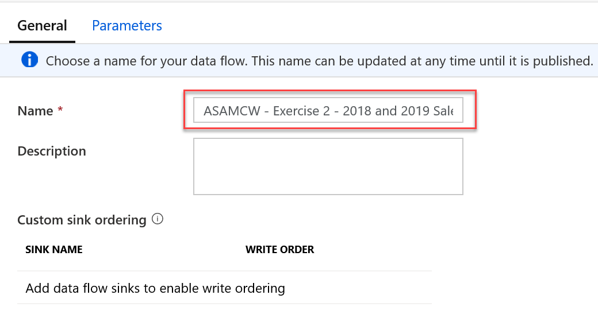

11. In the data flow designer window, select the **Add Source** box.

    

12. With the added source selected in the designer, in the lower pane with the **Source settings** tab selected, set the **Output stream name** to **salesdata** and for the **Dataset**, select **asamcw_sales_parquet**.
  
    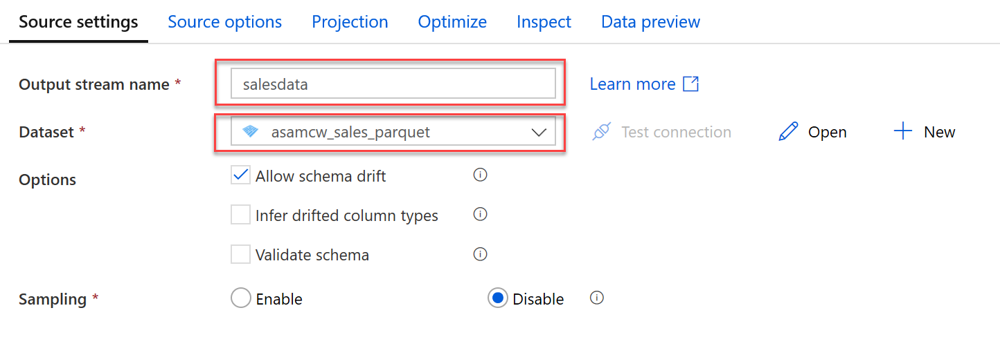

13. Select the **Source options** tab, and add the following as **Wildcard paths**, this will ensure that we only pull data from the parquet files for the sales years of 2018 and 2019:

    1. wwi-02/sale-small/Year=2018/\*/\*/\*/\*

    2. wwi-02/sale-small/Year=2019/\*/\*/\*/\*

      

14. At the bottom right of the **salesdata** source, expand the **+** button and select the **Sink** item located in the **Destination** section of the menu.

      

15. In the designer, select the newly added **Sink** element and in the bottom pane with the **Sink** tab selected, fill the form as follows:

    | Field | Value |
    |-------|-------|
    | Output stream name  | Enter **sale** |
    | Incoming stream | Select **salesdata**. |
    | Dataset | Select **asamcw_sale_asa**. |

    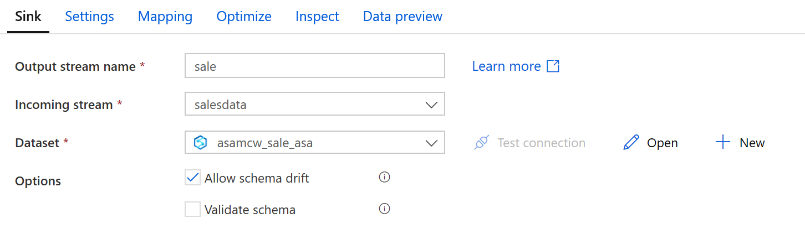

16. Select the **Mapping** tab and toggle the **Auto mapping** setting to the off position. You will need to add the following input to output column mappings. Add a mapping by selecting the **+ Add mapping** button.
  
    | Input column | Output column |
    |-------|-------|
    | TransactionDate  | TransactionDateId |
    | Hour | Hour |
    | Minute | Minute |
    | Quantity | Quantity |

    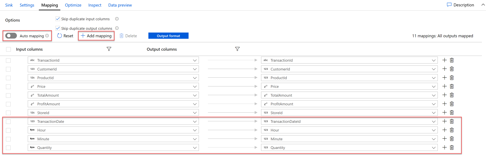

17. In the top toolbar, select **Publish all** to publish the new dataset definitions. When prompted, select the **Publish** button to deploy the new data flow to the workspace.

    

18. We can now use this data flow as an activity in a pipeline. Create a new pipeline by selecting **Orchestrate** from the left menu, and in the **Orchestrate** blade, expand the **+** button and select **Pipeline**.

19. Select the **Properties** button from the right side of the designer toolbar. On the **Properties** blade, Enter **ASAMCW - Exercise 2 - Copy Sale Data** as the Name of the pipeline.

20. From the **Activities** menu, expand the **Move & transform** section and drag an instance of **Data flow** to the design surface of the pipeline.
  
    

21. With the newly added data flow activity selected in the designer, in the bottom pane with the **General** tab selected, Name the data flow **ASAMCW - Exercise 2 - 2018 and 2019 Sales**.

22. Select the **Settings** tab and set the form fields to the following values:

    | Field | Value |
    |-------|-------|
    | Data flow  | Select **ASAMCW - Exercise 2 - 2018 and 2019 Sales** |
    | Staging linked service | Select `PrimaryStorage`. |
    | Staging storage folder - Container | Enter **staging** |
    | Staging storage folder - Folder | Enter **mcwsales** |

    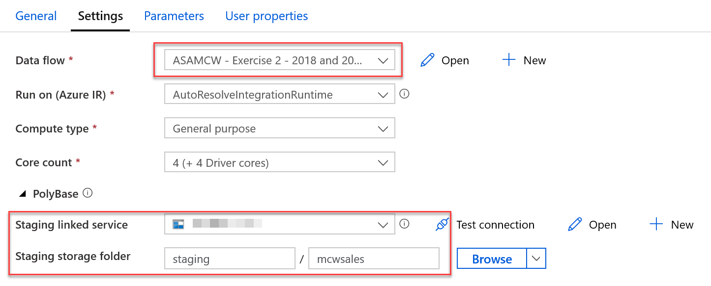

23. In the top toolbar, select **Publish all** to publish the new dataset definitions. When prompted, select the **Publish** button to commit the changes.

    

24. Once published, expand the **Add trigger** item on the pipeline designer toolbar, and select **Trigger now**. In the **Pipeline run** blade, select **OK** to proceed with the latest published configuration. You will see notification toast windows indicating the pipeline is running and when it has completed.

25. View the status of the pipeline run by locating the **ASAMCW - Exercise 2 - Copy Sale Data** pipeline in the Orchestrate blade. Expand the actions menu, and select the **Monitor** item.

    
  
26. You should see a run of the pipeline we created in the **Pipeline runs** table showing as in progress. It will take approximately 45 minutes for this pipeline operation to complete. You will need to refresh this table from time to time to see updated progress. Once it has completed. You should see the pipeline run displayed with a Status of **Succeeded**.
  
    

27. Verify the table has populated by creating a new query. Select the **Develop** item from the left menu, and in the **Develop** blade, expand the **+** button, and select **SQL script**. In the query window, be sure to connect to the SQL Pool database (`SQLPool01`), then paste and run the following query. When complete, select the **Discard all** button from the top toolbar.

  ```sql
    select count(TransactionId) from wwi_mcw.SaleSmall;
  ```

### Task 7: Populate the product table

When the lab environment was provisioned, the **wwi_mcw.Product** table and datasets required for its population were created. Throughout this exercise, you have gained experience creating datasets, data flows, and pipelines. The population of the product table would be repetitive, so we will simply trigger an existing pipeline to populate this table.

1. From the left menu, select **Orchestrate**. From the **Orchestrate** blade, expand the **Pipelines** section and locate and select the **ASAMCW - Exercise 2 - Copy Product Information** pipeline.

2. Expand the **Add trigger** item on the pipeline designer toolbar, and select **Trigger now**. In the **Pipeline run** blade, select **OK** to proceed with the latest published configuration. You will see notification toast windows indicating the pipeline is running and when it has completed.

3. View the status of the pipeline run by locating the **ASAMCW - Exercise 2 - Copy Product Information** pipeline in the Orchestrate blade. Expand the actions menu, and select the **Monitor** item.

4. You should see a run of the pipeline we created in the **Pipeline runs** table showing as in progress (or succeeded). Once it has completed. You should see the pipeline run displayed with a Status of **Succeeded**.

5. Verify the table has populated by creating a new query. Select the **Develop** item from the left menu, and in the **Develop** blade, expand the **+** button, and select **SQL script**. In the query window, be sure to connect to the SQL Pool database (`SQLPool01`), then paste and run the following query. When complete, select the **Discard all** button from the top toolbar.

  ```sql
    select * from wwi_mcw.Product;
  ```

## Exercise 3: Exploring raw parquet data

Understanding data through data exploration is one of the core challenges faced today by data engineers and data scientists as well. Depending on the underlying structure of the data as well as the specific requirements of the exploration process, different data processing engines will offer varying degrees of performance, complexity, and flexibility.

In Azure Synapse Analytics, you have the possibility of using either the Synapse SQL Serverless engine, the big-data Spark engine, or both.

In this exercise, you will explore the data lake using both options.

### Task 1: Query sales Parquet data with Synapse SQL Serverless

When you query Parquet files using Synapse SQL Serverless, you can explore the data with T-SQL syntax.

1. From the left menu, select **Data**.

2. Expand **Storage accounts**. Expand the `PrimaryStorage` ADLS Gen2 account and select **wwi-02**.

3. Navigate to the **sale-small/Year=2010/Quarter=Q4/Month=12/Day=20101231** folder. Right-click on the **sale-small-20101231-snappy.parquet** file, select **New SQL script**, then **Select TOP 100 rows**.

    

4. Ensure **SQL on-demand** is selected in the **Connect to** dropdown list above the query window, then run the query. Data is loaded by the Synapse SQL Serverless endpoint and processed as if was coming from any regular relational database.

    

5. Modify the SQL query to perform aggregates and grouping operations to better understand the data. Replace the query with the following, making sure that the file path in **OPENROWSET** matches your current file path, be sure to substitute `PrimaryStorage` for the appropriate value in your environment:

    ```sql
    SELECT
        TransactionDate, ProductId,
        CAST(SUM(ProfitAmount) AS decimal(18,2)) AS [(sum) Profit],
        CAST(AVG(ProfitAmount) AS decimal(18,2)) AS [(avg) Profit],
        SUM(Quantity) AS [(sum) Quantity]
    FROM
        OPENROWSET(
            BULK 'https://<PrimaryStorage>.dfs.core.windows.net/wwi-02/sale-small/Year=2010/Quarter=Q4/Month=12/Day=20101231/sale-small-20101231-snappy.parquet',
            FORMAT='PARQUET'
        ) AS [r] GROUP BY r.TransactionDate, r.ProductId;
    ```

    

6. Now let's figure out how many records are contained within the Parquet files for 2019 data. This information is important for planning how we optimize for importing the data into Azure Synapse Analytics. To do this, replace your query with the following (be sure to update the name of your data lake in BULK statement, by replacing `PrimaryStorage`):

    ```sql
    SELECT
        COUNT_BIG(*)
    FROM
        OPENROWSET(
            BULK 'https://<PrimaryStorage>.dfs.core.windows.net/wwi-02/sale-small/Year=2019/*/*/*/*',
            FORMAT='PARQUET'
        ) AS [r];
    ```

    > Notice how we updated the path to include all Parquet files in all subfolders of `sale-small/Year=2019`.

    The output should be **339507246** records.

### Task 2: Query sales Parquet data with Azure Synapse Spark

1. Select **Data** from the left menu, then browse to the data lake storage account folder **sale-small/Year=2010/Quarter=Q4/Month=12/Day=20101231** located in `PrimaryStorage` if needed, then right-click the Parquet file and select New notebook.

    

2. This will generate a notebook with PySpark code to load the data in a dataframe and display 100 rows with the header.

3. Attach the notebook to a Spark pool.

    

4. Select **Run all** on the notebook toolbar to execute the notebook.

    > **Note:** The first time you run a notebook in a Spark pool, Synapse creates a new session. This can take approximately 3 minutes.
    > **Note:** To run just the cell, either hover over the cell and select the _Run cell_ icon to the left of the cell, or select the cell then type **Ctrl+Enter** on your keyboard.

5. Create a new cell underneath by selecting **{} Add code** when hovering over the blank space at the bottom of the notebook.

    

6. The Spark engine can analyze the Parquet files and infer the schema. To do this, enter the following in the new cell:

    ```python
    data_path.printSchema()
    ```

    Your output should look like the following:

    ```text
    root
        |-- TransactionId: string (nullable = true)
        |-- CustomerId: integer (nullable = true)
        |-- ProductId: short (nullable = true)
        |-- Quantity: short (nullable = true)
        |-- Price: decimal(29,2) (nullable = true)
        |-- TotalAmount: decimal(29,2) (nullable = true)
        |-- TransactionDate: integer (nullable = true)
        |-- ProfitAmount: decimal(29,2) (nullable = true)
        |-- Hour: byte (nullable = true)
        |-- Minute: byte (nullable = true)
        |-- StoreId: short (nullable = true)
    ```

7. Now let's use the dataframe to perform the same grouping and aggregate query we performed with the SQL Serverless pool. Create a new cell and enter the following:

    ```python
    from pyspark.sql import SparkSession
    from pyspark.sql.types import *
    from pyspark.sql.functions import *

    profitByDateProduct = (data_path.groupBy("TransactionDate","ProductId")
        .agg(
            sum("ProfitAmount").alias("(sum)ProfitAmount"),
            round(avg("Quantity"), 4).alias("(avg)Quantity"),
            sum("Quantity").alias("(sum)Quantity"))
        .orderBy("TransactionDate"))
    profitByDateProduct.show(100)
    ```

 > We import required Python libraries to use aggregation functions and types defined in the schema to successfully execute the query.

## Exercise 4: Exploring raw text based data with Azure Synapse SQL Serverless

A common format for exporting and storing data is with text based files. These can delimited text files such as CSV as well as JSON structured data files. Azure Synapse Analytics also provides ways of querying into these types of raw files to gain valuable insights into the data without having to wait for them to be processed.

### Task 1: Query CSV data

1. Create a new SQL Script by selecting **Develop** from the left menu, then in the **Develop** blade, expanding the **+** button and selecting **SQL Query**.

2. Ensure **SQL on-demand** is selected in the **Connect to** dropdown list above the query window.

    

3. In this scenario, we will be querying into the CSV file that was used to populate the product table. This file is located in the `PrimaryStorage` account at: **wwi-02/data-generators/generator-product.csv**. We will select all data from this file. Copy and paste the following query into the query window and select **Run** from the query window toolbar menu. Remember to replace `PrimaryStorage` with your storage account name.

    ```sql
    SELECT
       csv.*
    FROM
        OPENROWSET(
            BULK 'https://<PrimaryStorage>.dfs.core.windows.net/wwi-02/data-generators/generator-product.csv',
            FORMAT='CSV',
            FIRSTROW = 1
        ) WITH (
            ProductID INT,
            Seasonality INT,
            Price DECIMAL(10,2),
            Profit DECIMAL(10,2)
        ) as csv
    ```

    > **Note**: In this query we are querying only a single file. Azure Synapse Analytics allows you to query across a series of CSV files (structured identically) by using wildcards in the path to the file(s).

4. You are also able to perform aggregations on this data. Replace the query with the following, and select **Run** from the toolbar menu. Remember to replace `PrimaryStorage` with your storage account name.

    ```sql
    SELECT
        Seasonality,
        SUM(Price) as TotalSalesPrice,
        SUM(Profit) as TotalProfit
    FROM
        OPENROWSET(
            BULK 'https://<PrimaryStorage>.dfs.core.windows.net/wwi-02/data-generators/generator-product.csv',
            FORMAT='CSV',
            FIRSTROW = 1
        ) WITH (
            ProductID INT,
            Seasonality INT,
            Price DECIMAL(10,2),
            Profit DECIMAL(10,2)
        ) as csv
    GROUP BY
        csv.Seasonality
    ```

5. After you have run the previous query, switch the view on the **Results** tab to **Chart** to see a visualization of the aggregation of this data. Feel free to experiment with the chart settings to obtain the best visualization!

    

6. From the top toolbar, select the **Discard all** button as we will not be saving this query. When prompted, choose to **Discard all changes**.

   

### Task 2: Query JSON data

1. Create a new SQL Script by selecting **Develop** from the left menu, then in the **Develop** blade, expanding the **+** button and selecting **SQL Query**.

2. Ensure **SQL on-demand** is selected in the **Connect to** dropdown list above the query window.

    

3. Replace the query with the following, remember to replace `PrimaryStorage` with the name of your storage account:

    ```sql
    SELECT
        products.*
    FROM
        OPENROWSET(
            BULK 'https://<PrimaryStorage>.dfs.core.windows.net/wwi-02/product-json/*.json',
            FORMAT='CSV',
            FIELDTERMINATOR ='0x0b',
            FIELDQUOTE = '0x0b',
            ROWTERMINATOR = '0x0b'
        )
        WITH (
            jsonContent NVARCHAR(200)
        ) AS [raw]
    CROSS APPLY OPENJSON(jsonContent)
    WITH (
        ProductId INT,
        Seasonality INT,
        Price DECIMAL(10,2),
        Profit DECIMAL(10,2)
    ) AS products
    ```

4. From the top toolbar, select the **Discard all** button as we will not be saving this query. When prompted, choose to **Discard all changes**.

   

## Exercise 5: Security

### Task 1: Column level security

It is important to identify data columns of that hold sensitive information. Types of sensitive information could be social security numbers, email addresses, credit card numbers, financial totals, and more. Azure Synapse Analytics allows you define permissions that prevent users or roles select privileges on specific columns.

1. Create a new SQL Script by selecting **Develop** from the left menu, then in the **Develop** blade, expanding the **+** button and selecting **SQL Query**.

2. Copy and paste the following query into the query window. Then, step through each statement by highlighting it in the query window, and selecting **Run** from the query window toolbar menu. The query is documented inline.

    ```sql
        /*  Column-level security feature in Azure Synapse simplifies the design and coding of security in applications.
        It ensures column level security by restricting column access to protect sensitive data. */

    /* Scenario: In this scenario we will be working with two users. The first one is the CEO, he has access to all
        data. The second one is DataAnalystMiami, this user doesn't have access to the confidential Revenue column
        in the CampaignAnalytics table. Follow this lab, one step at a time to see how Column-level security removes access to the
        Revenue column to DataAnalystMiami */

    --Step 1: Let us see how this feature in Azure Synapse works. Before that let us have a look at the Campaign Analytics table.
    select  Top 100 * from wwi_mcw.CampaignAnalytics
    where City is not null and state is not null

    /*  Consider a scenario where there are two users.
        A CEO, who is an authorized  personnel with access to all the information in the database
        and a Data Analyst, to whom only required information should be presented.*/

    -- Step:2 Verify the existence of the “CEO” and “DataAnalystMiami” users in the Datawarehouse.
    SELECT Name as [User1] FROM sys.sysusers WHERE name = N'CEO';
    SELECT Name as [User2] FROM sys.sysusers WHERE name = N'DataAnalystMiami';


    -- Step:3 Now let us enforcing column level security for the DataAnalystMiami.
    /*  The CampaignAnalytics table in the warehouse has information like ProductID, Analyst, CampaignName, Quantity, Region, State, City, RevenueTarget and Revenue.
        The Revenue generated from every campaign is classified and should be hidden from DataAnalystMiami.
    */

    REVOKE SELECT ON wwi_mcw.CampaignAnalytics FROM DataAnalystMiami;
    GRANT SELECT ON wwi_mcw.CampaignAnalytics([ProductID], [Analyst], [Product], [CampaignName],[Quantity], [Region], [State], [City], [RevenueTarget]) TO DataAnalystMiami;
    -- This provides DataAnalystMiami access to all the columns of the Sale table but Revenue.

    -- Step:4 Then, to check if the security has been enforced, we execute the following query with current User As 'DataAnalystMiami', this will result in an error
    --  since DataAnalystMiami doesn't have select access to the Revenue column
    EXECUTE AS USER ='DataAnalystMiami';
    select TOP 100 * from wwi_mcw.CampaignAnalytics;
    ---
    -- The following query will succeed since we are not including the Revenue column in the query.
    EXECUTE AS USER ='DataAnalystMiami';
    select [ProductID], [Analyst], [Product], [CampaignName],[Quantity], [Region], [State], [City], [RevenueTarget] from wwi_mcw.CampaignAnalytics;

    -- Step:5 Whereas, the CEO of the company should be authorized with all the information present in the warehouse.To do so, we execute the following query.
    Revert;
    GRANT SELECT ON wwi_mcw.CampaignAnalytics TO CEO;  --Full access to all columns.

    -- Step:6 Let us check if our CEO user can see all the information that is present. Assign Current User As 'CEO' and the execute the query
    EXECUTE AS USER ='CEO'
    select * from wwi_mcw.CampaignAnalytics
    Revert;
    ```

    

3. From the top toolbar, select the **Discard all** button as we will not be saving this query. When prompted, choose to **Discard all changes**.

   

### Task 2: Row level security

In many organizations it is important to filter certain rows of data by user. In the case of WWI, they wish to have data analysts only see their data. In the campaign analytics table, there is an Analyst column that indicates to which analyst that row of data belongs. In the past, organizations would create views for each analyst - this was a lot of work and unnecessary overhead. Using Azure Synapse Analytics, you can define row level security that compares the user executing the query to the Analyst column, filtering the data so they only see the data destined for them.

1. Create a new SQL Script by selecting **Develop** from the left menu, then in the **Develop** blade, expanding the **+** button and selecting **SQL Query**.

2. Copy and paste the following query into the query window. Then, step through each statement by highlighting it in the query window, and selecting **Run** from the query window toolbar menu. The query is documented inline.

    ```sql
    /* Row level Security (RLS) in Azure Synapse enables us to use group membership to control access to rows in a table.
    Azure Synapse applies the access restriction every time the data access is attempted from any user.
    Let see how we can implement row level security in Azure Synapse.*/

    -- Row-Level Security (RLS), 1: Filter predicates
    -- Step:1 The Sale table has two Analyst values: DataAnalystMiami and DataAnalystSanDiego. 
    --     Each analyst has jurisdiction across a specific Region. DataAnalystMiami on the South East Region
    --      and DataAnalystSanDiego on the Far West region.
    SELECT DISTINCT Analyst, Region FROM wwi_mcw.CampaignAnalytics order by Analyst ;

    /* Scenario: WWI requires that an Analyst only see the data for their own data from their own region. The CEO should see ALL data.
        In the Sale table, there is an Analyst column that we can use to filter data to a specific Analyst value. */

    /* We will define this filter using what is called a Security Predicate. This is an inline table-valued function that allows
        us to evaluate additional logic, in this case determining if the Analyst executing the query is the same as the Analyst
        specified in the Analyst column in the row. The function returns 1 (will return the row) when a row in the Analyst column is the same as the user executing the query (@Analyst = USER_NAME()) or if the user executing the query is the CEO user (USER_NAME() = 'CEO')
        whom has access to all data.
    */

    -- Review any existing security predicates in the database
    SELECT * FROM sys.security_predicates

    --Step:2 Create a new Schema to hold the security predicate, then define the predicate function. It returns 1 (or True) when
    --  a row should be returned in the parent query.
    GO
    CREATE SCHEMA Security
    GO
    CREATE FUNCTION Security.fn_securitypredicate(@Analyst AS sysname)  
        RETURNS TABLE  
    WITH SCHEMABINDING  
    AS  
        RETURN SELECT 1 AS fn_securitypredicate_result
        WHERE @Analyst = USER_NAME() OR USER_NAME() = 'CEO'
    GO
    -- Now we define security policy that adds the filter predicate to the Sale table. This will filter rows based on their login name.
    CREATE SECURITY POLICY SalesFilter  
    ADD FILTER PREDICATE Security.fn_securitypredicate(Analyst)
    ON wwi_mcw.CampaignAnalytics
    WITH (STATE = ON);

    ------ Allow SELECT permissions to the Sale Table.------
    GRANT SELECT ON wwi_mcw.CampaignAnalytics TO CEO, DataAnalystMiami, DataAnalystSanDiego;

    -- Step:3 Let us now test the filtering predicate, by selecting data from the Sale table as 'DataAnalystMiami' user.
    EXECUTE AS USER = 'DataAnalystMiami'
    SELECT * FROM wwi_mcw.CampaignAnalytics;
    revert;
    -- As we can see, the query has returned rows here Login name is DataAnalystMiami

    -- Step:4 Let us test the same for  'DataAnalystSanDiego' user.
    EXECUTE AS USER = 'DataAnalystSanDiego';
    SELECT * FROM wwi_mcw.CampaignAnalytics;
    revert;
    -- RLS is working indeed.

    -- Step:5 The CEO should be able to see all rows in the table.
    EXECUTE AS USER = 'CEO';  
    SELECT * FROM wwi_mcw.CampaignAnalytics;
    revert;
    -- And he can.

    --Step:6 To disable the security policy we just created above, we execute the following.
    ALTER SECURITY POLICY SalesFilter  
    WITH (STATE = OFF);

    DROP SECURITY POLICY SalesFilter;
    DROP FUNCTION Security.fn_securitypredicate;
    DROP SCHEMA Security;
    ```

    

3. From the top toolbar, select the **Discard all** button as we will not be saving this query. When prompted, choose to **Discard all changes**.

   

### Task 3: Dynamic data masking

As an alternative to column level security, SQL Administrators also have the option of masking sensitive data. This will result in data being obfuscated when returned in queries. The data is still stored in a pristine state in the table itself. SQL Administrators can grant unmask privileges to users that have permissions to see this data.

1. Create a new SQL Script by selecting **Develop** from the left menu, then in the **Develop** blade, expanding the **+** button and selecting **SQL Query**.

2. Copy and paste the following query into the query window. Then, step through each statement by highlighting it in the query window, and selecting **Run** from the query window toolbar menu. The query is documented inline.

    ```sql
    ----- Dynamic Data Masking (DDM) ---------
    /*  Dynamic data masking helps prevent unauthorized access to sensitive data by enabling customers
        to designate how much of the sensitive data to reveal with minimal impact on the application layer.
        Let see how */

    /* Scenario: WWI has identified sensitive information in the CustomerInfo table. They would like us to
        obfuscate the CreditCard and Email columns of the CustomerInfo table to DataAnalysts */

    -- Step:1 Let us first get a view of CustomerInfo table.
    SELECT TOP (100) * FROM wwi_mcw.CustomerInfo;

    -- Step:2 Let's confirm that there are no Dynamic Data Masking (DDM) applied on columns.
    SELECT c.name, tbl.name as table_name, c.is_masked, c.masking_function  
    FROM sys.masked_columns AS c  
    JOIN sys.tables AS tbl
        ON c.[object_id] = tbl.[object_id]  
    WHERE is_masked = 1
        AND tbl.name = 'CustomerInfo';
    -- No results returned verify that no data masking has been done yet.

    -- Step:3 Now lets mask 'CreditCard' and 'Email' Column of 'CustomerInfo' table.
    ALTER TABLE wwi_mcw.CustomerInfo  
    ALTER COLUMN [CreditCard] ADD MASKED WITH (FUNCTION = 'partial(0,"XXXX-XXXX-XXXX-",4)');
    GO
    ALTER TABLE wwi_mcw.CustomerInfo
    ALTER COLUMN Email ADD MASKED WITH (FUNCTION = 'email()');
    GO
    -- The columns are successfully masked.

    -- Step:4 Let's see Dynamic Data Masking (DDM) applied on the two columns.
    SELECT c.name, tbl.name as table_name, c.is_masked, c.masking_function  
    FROM sys.masked_columns AS c  
    JOIN sys.tables AS tbl
        ON c.[object_id] = tbl.[object_id]  
    WHERE is_masked = 1
        AND tbl.name ='CustomerInfo';

    -- Step:5 Now, let us grant SELECT permission to 'DataAnalystMiami' on the 'CustomerInfo' table.
   GRANT SELECT ON wwi_mcw.CustomerInfo TO DataAnalystMiami;  

    -- Step:6 Logged in as  'DataAnalystMiami' let us execute the select query and view the result.
    EXECUTE AS USER = 'DataAnalystMiami';  
    SELECT * FROM wwi_mcw.CustomerInfo;

    -- Step:7 Let us remove the data masking using UNMASK permission
    GRANT UNMASK TO DataAnalystMiami;
    EXECUTE AS USER = 'DataAnalystMiami';  
    SELECT *
    FROM wwi_mcw.CustomerInfo;
    revert;
    REVOKE UNMASK TO DataAnalystMiami;  

    ----step:8 Reverting all the changes back to as it was.
    ALTER TABLE wwi_mcw.CustomerInfo
    ALTER COLUMN CreditCard DROP MASKED;
    GO
    ALTER TABLE wwi_mcw.CustomerInfo
    ALTER COLUMN Email DROP MASKED;
    GO
    ```

    

3. From the top toolbar, select the **Discard all** button as we will not be saving this query. When prompted, choose to **Discard all changes**.

   

## Exercise 6: Machine Learning

Azure Synapse Analytics provides a unified environment for both data science and data engineering. What this means in practice, is that your data scientists can train and deploy models using Azure Synapse Analytics and your data engineers can write T-SQL queries that use those models to make predictions against tabular data stored in a SQL Pool database table.

In this lab, you will create several machine learning models and use them to make predictions using the T-SQL `Predict` statement.

For context, the following are the high level steps taken to create a Spark ML based model and deploy it so it is ready for use from T-SQL.


All of the steps are performed within your Azure Synapse Analytics Studio.

- Within a notebook, a data scientist will:

  a. Train a model using Spark ML, the machine learning library included with Apache Spark. Models can also be trained using other approaches, including by using Azure Machine Learning automated ML. The main requirement is that the model format must be supported by ONNX.

  b. Convert the model to the ONNX format using the `onnxml` tools.

  c. Save a hexadecimal encoded version of the ONNX model to a table in the SQL Pool database. This is an interim step while this feature is in preview.

- To use the model for making predictions, in a SQL Script a data engineer will:

  a. Read the model into a binary variable by querying it from the table in which it was stored.

  b. Execute a query using the `FROM PREDICT` statement as you would a table. This statement defines both the model to use and the query to execute that will provide the data used for prediction. You can then take these predictions and insert them into a table for use by downstream analytics applications.

> What is ONNX? [ONNX](https://onnx.ai/) is an acronym for the Open Neural Network eXchange and is an open format built to represent machine learning models, regardless of what frameworks were used to create the model. This enables model portability, as models in the ONNX format can be run using a wide variety of frameworks, tools, runtimes and platforms. Think of it like a universal file format for machine learning models.

### Task 1: Training models

Open the **ASAMCW - Exercise 6 - Machine Learning** notebook (select **Develop** from the left menu, from the **Develop** menu, expand the **Notebooks** section and select the notebook) and run it step by step to complete this exercise. Some of the most important tasks you will perform are:

- Exploratory data analysis (basic stats)
- Use PCA for dimensionality reduction
- Train ensemble of trees classifier (using XGBoost)
- Train classifier using Auto ML

Please note that each of these tasks will be addressed through several cells in the notebook.

### Task 2: Registering the models with Azure Synapse Analytics

In this task, you will explore the model registration process in Azure Synapse Analytics that enables trained model for use from T-SQL. This task picks up where you left off, with the ONNX model being made available in Azure Storage.

1. One step that is not shown by the notebook is an offline step that converts the ONNX model to hexadecimal. The resulting hex encoded model is also upload to Azure Storage. This conversion is currently performed with [this PowerShell script](https://github.com/solliancenet/azure-synapse-analytics-workshop-400/raw/master/artifacts/day-03/lab-06-machine-learning/convert-to-hex.ps1), but could be automated using any scripting platform.

2. From the left menu, select **Data**.

3. Expand the **Databases** section, right click your SQL Pool, `SQLPool01`, and then select **New SQL Script**, and then **Empty script**.

   

4. Replace the contents of this script with following:

    ```sql
    SELECT
        *
    FROM
        [wwi_mcw].[MLModelExt]
    ```

    The result shows your persisted ONNX model in hexadecimal format:

    

5. `MLModelExt` is an external table that maps to the data lake location where the trained model was persisted (and then converted to hexadecimal format). Take a moment to read through the code that was used to create the external table (you don't need to run this code as it was already run during the deployment of your environment):

    ``` sql
      -- Replace <data_lake_account_key> with the key of the primary data lake account

      CREATE DATABASE SCOPED CREDENTIAL StorageCredential
      WITH
      IDENTITY = 'SHARED ACCESS SIGNATURE'
      ,SECRET = '<data_lake_account_key>';

      -- Create an external data source with CREDENTIAL option.
      -- Replace <data_lake_account_name> with the actual name of the primary data lake account

      CREATE EXTERNAL DATA SOURCE ASAMCWModelStorage
      WITH
      (
          LOCATION = 'wasbs://wwi-02@<data_lake_account_name>.blob.core.windows.net'
          ,CREDENTIAL = StorageCredential
          ,TYPE = HADOOP
      );

      CREATE EXTERNAL FILE FORMAT csv
      WITH (
          FORMAT_TYPE = DELIMITEDTEXT,
          FORMAT_OPTIONS (
              FIELD_TERMINATOR = ',',
              STRING_DELIMITER = '',
              DATE_FORMAT = '',
              USE_TYPE_DEFAULT = False
          )
      );

      CREATE EXTERNAL TABLE [wwi_mcw].[ASAMCWMLModelExt]
      (
      [Model] [varbinary](max) NULL
      )
      WITH
      (
          LOCATION='/ml/onnx-hex' ,
          DATA_SOURCE = ModelStorage ,
          FILE_FORMAT = csv ,
          REJECT_TYPE = VALUE ,
          REJECT_VALUE = 0
      );
      GO

      CREATE TABLE [wwi_mcw].[ASAMCWMLModel]
      (
          [Id] [int] IDENTITY(1,1) NOT NULL,
          [Model] [varbinary](max) NULL,
          [Description] [varchar](200) NULL
      )
      WITH
      (
          DISTRIBUTION = REPLICATE,
          HEAP
      );
      GO
    ```

6. Import the persisted ONNX model in hexadecimal format into the main models table (to be later used with the `PREDICT` function):

    ```sql
    -- Register the model by inserting it into the table.
    INSERT INTO
        [wwi_mcw].[ASAMCWMLModel]
    SELECT
        Model, 'Product Seasonality Classifier'
    FROM
        [wwi_mcw].[ASAMCWMLModelExt]
    ```

### Task 3: Making predictions with the registered models

In this task, you will author a T-SQL query that uses the previously trained model to make predictions.

1. From the left menu, select **Data**.

2. Expand the **Databases** section, right-click your SQL Pool and then select **New SQL Script**, and then **Empty script**.

   

3. Replace the contents of this script with following:

    ```sql
    SELECT TOP 100
        *
    FROM
        [wwi_mcw].[ProductPCA]
    WHERE
        ProductId > 4500
    ```

    This is the input data you will use to make the predictions.

4. Select **Run** from the menubar.

   

5. Create another new SQL script and replace the contents with the following:

   ```sql
   -- Retrieve the latest hex encoded ONNX model from the table
   DECLARE @model varbinary(max) = (SELECT Model FROM [wwi_mcw].[ASAMCWMLModel] WHERE Id = (SELECT Top(1) max(ID) FROM [wwi_mcw].[ASAMCWMLModel]));

   -- Run a prediction query
   SELECT d.*, p.*
   FROM PREDICT(MODEL = @model, DATA = [wwi_mcw].[ProductPCA] AS d) WITH (prediction real) AS p;
   ```

6. Run the script and view the results, notice that the `Prediction` column is the model's prediction of the `Seasonality` property of each product.

   

## Exercise 7: Monitoring

Azure Synapse Analytics provides a rich monitoring experience within the Azure portal to surface insights regarding your data warehouse workload.

You can monitor active SQL requests using the SQL requests area of the Monitor Hub. This includes details like the pool, submitter, duration, queued duration, workload group assigned, importance, and the request content.

Pipeline runs can be monitored using the Monitor Hub and selecting Pipeline runs. Here you can filter pipeline runs and drill in to view the activity runs associated with the pipeline run and monitor the running of in-progress pipelines.

### Task 1: Workload Importance

Running mixed workloads can pose resource challenges on busy systems. Solution Architects seek ways to separate classic data warehousing activities (such as loading, transforming, and querying data) to ensure that enough resources exist to hit SLAs.

Synapse SQL pool workload management in Azure Synapse consists of three high-level concepts: Workload Classification, Workload Importance and Workload Isolation. These capabilities give you more control over how your workload utilizes system resources.

Workload importance influences the order in which a request gets access to resources. On a busy system, a request with higher importance has first access to resources. Importance can also ensure ordered access to locks.

Setting importance in Synapse SQL for Azure Synapse allows you to influence the scheduling of queries. Queries with higher importance will be scheduled to run before queries with lower importance. To assign importance to queries, you need to create a workload classifier.

1. Navigate to the **Develop** hub.

    

2. From the **Develop** menu, select the + button and choose **SQL Script** from the context menu.

    

3. In the toolbar menu, connect to the **SQL Pool** database to execute the query.

    

4. In the query window, replace the script with the following to confirm that there are no queries currently being run by users logged in as `asa.sql.workload01`, representing the CEO of the organization or `asa.sql.workload02` representing the data analyst working on the project:

    ```sql
    --First, let's confirm that there are no queries currently being run by users logged in as CEONYC or AnalystNYC.

    SELECT s.login_name, r.[Status], r.Importance, submit_time,
    start_time ,s.session_id FROM sys.dm_pdw_exec_sessions s
    JOIN sys.dm_pdw_exec_requests r ON s.session_id = r.session_id
    WHERE s.login_name IN ('asa.sql.workload01','asa.sql.workload02') and Importance
    is not NULL AND r.[status] in ('Running','Suspended')
    --and submit_time>dateadd(minute,-2,getdate())
    ORDER BY submit_time ,s.login_name
    ```

5. Select **Run** from the toolbar menu to execute the SQL command.

    

6. You will flood the system with queries and see what happens for `asa.sql.workload01` and `asa.sql.workload02`. To do this, we'll run a Azure Synapse Pipeline which triggers queries. Select the `Orchestrate` Tab. **Run** the **Exercise 7 - Execute Data Analyst and CEO Queries** Pipeline, which will run / trigger the `asa.sql.workload01` and `asa.sql.workload02` queries. You can run the pipeline with the Debug option if you have an instance of the Integration Runtime running. Otherwise, select **Add trigger**, then **Trigger now**. In the dialog that appears, select **OK**.

    

7. Let's see what happened to all the queries we just triggered as they flood the system. In the query window, replace the script with the following:

    ```sql
    SELECT s.login_name, r.[Status], r.Importance, submit_time, start_time ,s.session_id FROM sys.dm_pdw_exec_sessions s
    JOIN sys.dm_pdw_exec_requests r ON s.session_id = r.session_id
    WHERE s.login_name IN ('asa.sql.workload01','asa.sql.workload02') and Importance
    is not NULL AND r.[status] in ('Running','Suspended') and submit_time>dateadd(minute,-2,getdate())
    ORDER BY submit_time ,status
    ```

8. Select **Run** from the toolbar menu to execute the SQL command. You should see an output similar to the following:

    

9. We will give our `asa.sql.workload01` user queries priority by implementing the **Workload Importance** feature. In the query window, replace the script with the following:

    ```sql
    IF EXISTS (SELECT * FROM sys.workload_management_workload_classifiers WHERE name = 'CEO')
    BEGIN
        DROP WORKLOAD CLASSIFIER CEO;
    END
    CREATE WORKLOAD CLASSIFIER CEO
      WITH (WORKLOAD_GROUP = 'largerc'
      ,MEMBERNAME = 'asa.sql.workload01',IMPORTANCE = High);
    ```

10. Select **Run** from the toolbar menu to execute the SQL command.

11. Let's flood the system again with queries and see what happens this time for `asa.sql.workload01` and `asa.sql.workload02` queries. To do this, we'll run an Azure Synapse Pipeline which triggers queries. **Select** the `Orchestrate` Tab, **run** the **Exercise 7 - Execute Data Analyst and CEO Queries** Pipeline, which will run / trigger the `asa.sql.workload01` and `asa.sql.workload02` queries.

12. In the query window, replace the script with the following to see what happens to the `asa.sql.workload01` queries this time:

    ```sql
    SELECT s.login_name, r.[Status], r.Importance, submit_time, start_time ,s.session_id FROM sys.dm_pdw_exec_sessions s
    JOIN sys.dm_pdw_exec_requests r ON s.session_id = r.session_id
    WHERE s.login_name IN ('asa.sql.workload01','asa.sql.workload02') and Importance
    is not NULL AND r.[status] in ('Running','Suspended') and submit_time>dateadd(minute,-2,getdate())
    ORDER BY submit_time ,status desc
    ```

13. Select **Run** from the toolbar menu to execute the SQL command. You should see an output similar to the following that shows query executions for the `asa.sql.workload01` user having a **high** importance.

    

14. Navigate to the **Monitor** hub, select **Pipeline runs**, and then select **Cancel recursive** for each running Exercise 7 pipelines. This will help speed up the remaining tasks.

    

### Task 2: Workload Isolation

Workload isolation means resources are reserved, exclusively, for a workload group. Workload groups are containers for a set of requests and are the basis for how workload management, including workload isolation, is configured on a system. A simple workload management configuration can manage data loads and user queries.

In the absence of workload isolation, requests operate in the shared pool of resources. Access to resources in the shared pool is not guaranteed and is assigned on an importance basis.

Configuring workload isolation should be done with caution as the resources are allocated to the workload group even if there are no active requests in the workload group. Over-configuring isolation can lead to diminished overall system utilization.

Users should avoid a workload management solution that configures 100% workload isolation: 100% isolation is achieved when the sum of `min_percentage_resource` configured across all workload groups equals 100%. This type of configuration is overly restrictive and rigid, leaving little room for resource requests that are accidentally misclassified. There is a provision to allow one request to execute from workload groups not configured for isolation.

1. Navigate to the **Develop** hub.

    

2. From the **Develop** menu, select the + button and choose **SQL Script** from the context menu.

    

3. In the toolbar menu, connect to the **SQL Pool** database to execute the query.

    

4. In the query window, replace the script with the following:

    ```sql
    IF NOT EXISTS (SELECT * FROM sys.workload_management_workload_groups where name = 'CEODemo')
    BEGIN
        Create WORKLOAD GROUP CEODemo WITH  
        ( MIN_PERCENTAGE_RESOURCE = 50        -- integer value
        ,REQUEST_MIN_RESOURCE_GRANT_PERCENT = 25 --  
        ,CAP_PERCENTAGE_RESOURCE = 100
        )
    END
    ```

    The code creates a workload group called `CEODemo` to reserve resources exclusively for the workload group. In this example, a workload group with a `MIN_PERCENTAGE_RESOURCE` set to 50% and `REQUEST_MIN_RESOURCE_GRANT_PERCENT` set to 25% is guaranteed 2 concurrency.

5. Select **Run** from the toolbar menu to execute the SQL command.

6. In the query window, replace the script with the following to create a workload Classifier called `CEODreamDemo` that assigns a workload group and importance to incoming requests:

    ```sql
    IF NOT EXISTS (SELECT * FROM sys.workload_management_workload_classifiers where  name = 'CEODreamDemo')
    BEGIN
        Create Workload Classifier CEODreamDemo with
        ( Workload_Group ='CEODemo',MemberName='asa.sql.workload02',IMPORTANCE = BELOW_NORMAL);
    END
    ```

7. Select **Run** from the toolbar menu to execute the SQL command.

8. In the query window, replace the script with the following to confirm that there are no active queries being run by `asa.sql.workload02`:

    ```sql
    SELECT s.login_name, r.[Status], r.Importance, submit_time,
    start_time ,s.session_id FROM sys.dm_pdw_exec_sessions s
    JOIN sys.dm_pdw_exec_requests r ON s.session_id = r.session_id
    WHERE s.login_name IN ('asa.sql.workload02') and Importance
    is not NULL AND r.[status] in ('Running','Suspended')
    ORDER BY submit_time, status
    ```

9. Let's flood the system with queries and see what happens for `asa.sql.workload02`. To do this, we will run a Azure Synapse Pipeline which triggers queries. Select the `Orchestrate` Tab. **Run** the **Exercise 7 - Execute Business Analyst Queries** Pipeline, which will run / trigger  `asa.sql.workload02` queries.

10. In the query window, replace the script with the following to see what happened to all the `asa.sql.workload02` queries we just triggered as they flood the system:

    ```sql
    SELECT s.login_name, r.[Status], r.Importance, submit_time,
    start_time ,s.session_id FROM sys.dm_pdw_exec_sessions s
    JOIN sys.dm_pdw_exec_requests r ON s.session_id = r.session_id
    WHERE s.login_name IN ('asa.sql.workload02') and Importance
    is not NULL AND r.[status] in ('Running','Suspended')
    ORDER BY submit_time, status
    ```

11. Select **Run** from the toolbar menu to execute the SQL command. You should see an output similar to the following that shows the importance for each session set to `below_normal`:

    

12. Navigate to the **Monitor** hub, select **Pipeline runs**, and then select **Cancel recursive** for each running Exercise 7 pipelines. This will help speed up the remaining tasks.

    

13. In the query window, replace the script with the following to set 3.25% minimum resources per request:

    ```sql
    IF  EXISTS (SELECT * FROM sys.workload_management_workload_classifiers where group_name = 'CEODemo')
    BEGIN
        Drop Workload Classifier CEODreamDemo
        DROP WORKLOAD GROUP CEODemo
        --- Creates a workload group 'CEODemo'.
            Create  WORKLOAD GROUP CEODemo WITH  
        (MIN_PERCENTAGE_RESOURCE = 26 -- integer value
            ,REQUEST_MIN_RESOURCE_GRANT_PERCENT = 3.25 -- factor of 26 (guaranteed more than 4 concurrencies)
        ,CAP_PERCENTAGE_RESOURCE = 100
        )
        --- Creates a workload Classifier 'CEODreamDemo'.
        Create Workload Classifier CEODreamDemo with
        (Workload_Group ='CEODemo',MemberName='asa.sql.workload02',IMPORTANCE = BELOW_NORMAL);
    END
    ```

    > **Note**: Configuring workload containment implicitly defines a maximum level of concurrency. With a CAP_PERCENTAGE_RESOURCE set to 60% and a REQUEST_MIN_RESOURCE_GRANT_PERCENT set to 1%, up to a 60-concurrency level is allowed for the workload group. Consider the method included below for determining the maximum concurrency:
    > 
    > [Max Concurrency] = [CAP_PERCENTAGE_RESOURCE] / [REQUEST_MIN_RESOURCE_GRANT_PERCENT]

14. Let's flood the system again and see what happens for `asa.sql.workload02`. To do this, we will run an Azure Synapse Pipeline which triggers queries. Select the `Orchestrate` Tab. **Run** the **Exercise 7 - Execute Business Analyst Queries** Pipeline, which will run / trigger  `asa.sql.workload02` queries.

15. In the query window, replace the script with the following to see what happened to all of the `asa.sql.workload02` queries we just triggered as they flood the system:

    ```sql
    SELECT s.login_name, r.[Status], r.Importance, submit_time,
    start_time ,s.session_id FROM sys.dm_pdw_exec_sessions s
    JOIN sys.dm_pdw_exec_requests r ON s.session_id = r.session_id
    WHERE s.login_name IN ('asa.sql.workload02') and Importance
    is  not NULL AND r.[status] in ('Running','Suspended')
    ORDER BY submit_time, status
    ```

16. Select **Run** from the toolbar menu to execute the SQL command.

### Task 3: Monitoring with Dynamic Management Views

For a programmatic experience when monitoring SQL Analytics via T-SQL, the service provides a set of Dynamic Management Views (DMVs). These views are useful when actively troubleshooting and identifying performance bottlenecks with your workload.

All logins to your data warehouse are logged to `sys.dm_pdw_exec_sessions`. This DMV contains the last 10,000 logins. The `session_id` is the primary key and is assigned sequentially for each new logon.

1. Navigate to the **Develop** hub.

    

2. From the **Develop** menu, select the + button and choose **SQL Script** from the context menu.

    

3. In the toolbar menu, connect to the **SQL Pool** database to execute the query.

    

4. In the query window, replace the script with the following:

    ```sql
    SELECT * FROM sys.dm_pdw_exec_sessions where status <> 'Closed' and session_id <> session_id();
    ```

    All queries executed on SQL pool are logged to `sys.dm_pdw_exec_requests`. This DMV contains the last 10,000 queries executed. The `request_id` uniquely identifies each query and is the primary key for this DMV. The `request_id` is assigned sequentially for each new query and is prefixed with `QID`, which stands for query ID. Querying this DMV for a given `session_id` shows all queries for a given logon.

5. Select **Run** from the toolbar menu to execute the SQL command.

6. Let's flood the system with queries to create operations to monitor. To do this, we will run a Azure Synapse Pipeline which triggers queries. Select the `Orchestrate` Tab. **Run** the **Exercise 7 - Execute Business Analyst Queries** Pipeline, which will run / trigger  `asa.sql.workload02` queries.

7. In the query window, replace the script with the following:

    ```sql
    SELECT *
    FROM sys.dm_pdw_exec_requests
    WHERE status not in ('Completed','Failed','Cancelled')
      AND session_id <> session_id()
    ORDER BY submit_time DESC;
    ```

8. Select **Run** from the toolbar menu to execute the SQL command. You should see a list of sessions in the query results similar to the following. **Note the `Request_ID` of a query** in the results that you would like to investigate (*keep this value in a text editor for a later step*):

    

9. As an alternative, you can execute the following SQL command to find the top 10 longest running queries.

    ```sql
    SELECT TOP 10 *
    FROM sys.dm_pdw_exec_requests
    ORDER BY total_elapsed_time DESC;
    ```

10. To simplify the lookup of a query in the `sys.dm_pdw_exec_requests` table, use `LABEL` to assign a comment to your query, which can be looked up in the `sys.dm_pdw_exec_requests` view. To test using the labels, replace the script in the query window with the following:

    ```sql
    SELECT *
    FROM sys.tables
    OPTION (LABEL = 'My Query');
    ```

11. Select **Run** from the toolbar menu to execute the SQL command.

12. In the query window, replace the script with the following to filter the results with the label, `My Query`.

    ```sql
    -- Find a query with the Label 'My Query'
    -- Use brackets when querying the label column, as it it a key word
    SELECT  *
    FROM sys.dm_pdw_exec_requests
    WHERE [label] = 'My Query';
    ```

13. Select **Run** from the toolbar menu to execute the SQL command. You should see the previously run query in the results view.

14. In the query window, replace the script with the following to retrieve the query's distributed SQL (DSQL) plan from `sys.dm_pdw_request_steps`. **Be sure to replace** the `QID#####` with the `Request_ID` you noted in Step 8:

    ```sql
    SELECT * FROM sys.dm_pdw_request_steps
    WHERE request_id = 'QID####'
    ORDER BY step_index;
    ```

15. Select **Run** from the toolbar menu to execute the SQL command. You should see results showing the distributed query plan steps for the specified request:

    

    > When a DSQL plan is taking longer than expected, the cause can be a complex plan with many DSQL steps or just one step taking a long time. If the plan is many steps with several move operations, consider optimizing your table distributions to reduce data movement.

### Task 4: Orchestration Monitoring with the Monitor Hub

1. Let's run a pipeline to monitor its execution in the next step. To do this, select the `Orchestrate` Tab. **Run** the **Exercise 7 - Execute Business Analyst Queries** Pipeline.

    

2. Navigate to the `Monitor` hub. Then select **Pipeline runs** to get a list of pipelines that ran during the last 24 hours. Observe the Pipeline status.

    

3. Hover over the running pipeline and select **Cancel** to cancel the execution of the current instance of the pipeline.

    

### Task 5: Monitoring SQL Requests with the Monitor Hub

1. Let's run a pipeline to monitor its execution in the next step. To do this, select the `Orchestrate` Tab. **Run** the **Exercise 7 - Execute Business Analyst Queries** Pipeline.

    

2. Navigate to the `Monitor` hub. Then select **SQL requests** to get a list of SQL requests that ran during the last 24 hours.

3. Select the **Pool** filter and select your SQL Pool. Observe the `Request Submitter`, `Submit Time`, `Duration`, and `Queued Duration` values.

    

4. Hover onto a SQL Request log and select `Request Content` to access the actual T-SQL command executed as part of the SQL Request.

    
  
## After the hands-on lab

### Task 1: Delete the resource group

1. In the Azure Portal, open the resource group for this lab. Select **Delete** from the top toolbar menu.

You should follow all steps provided *after* attending the Hands-on lab.
