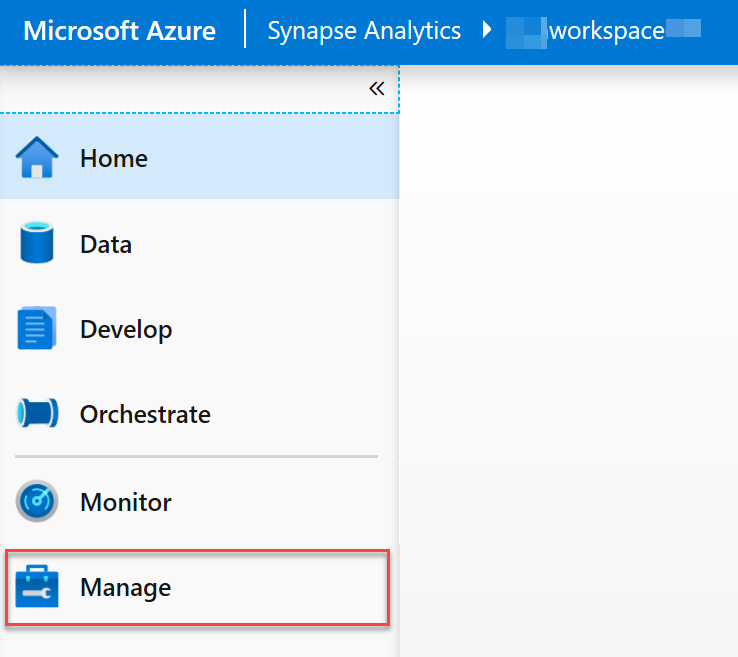
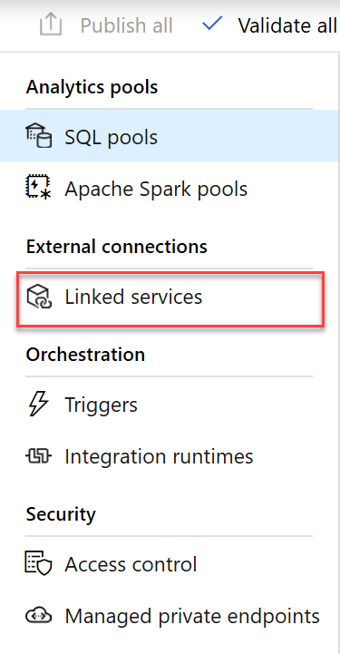
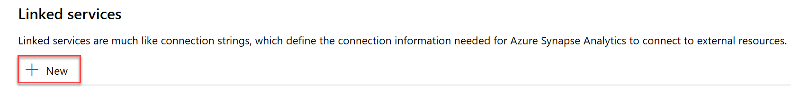
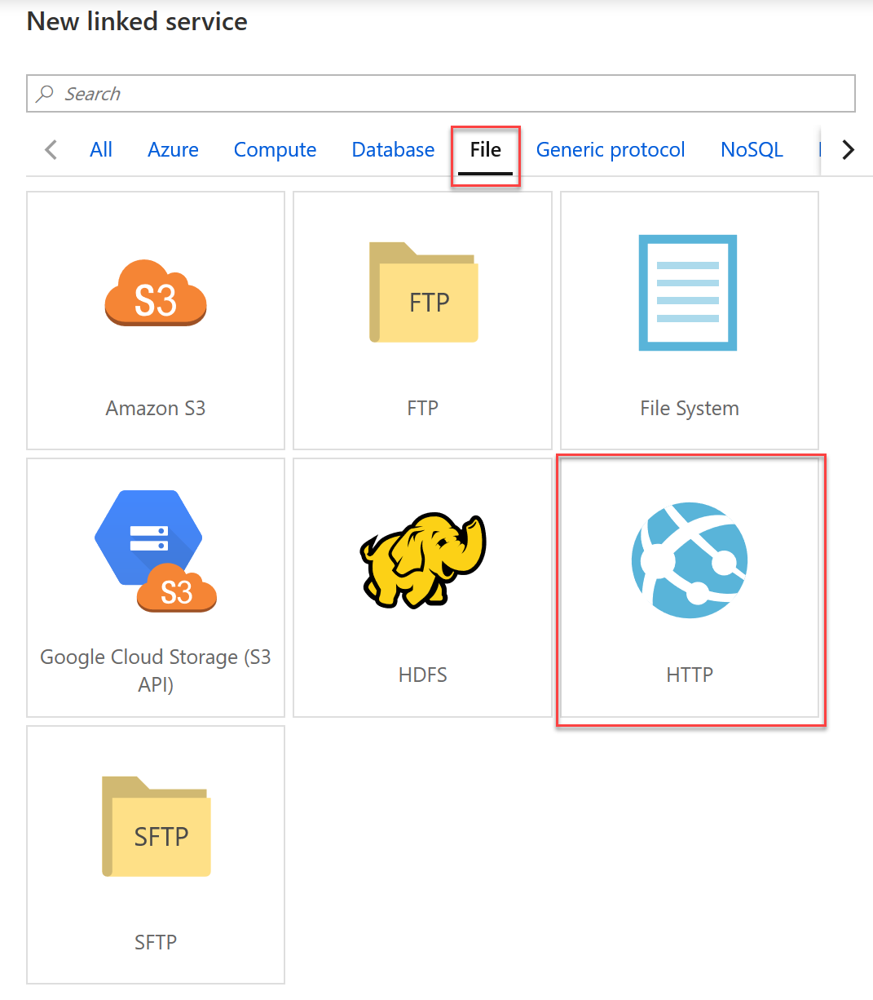
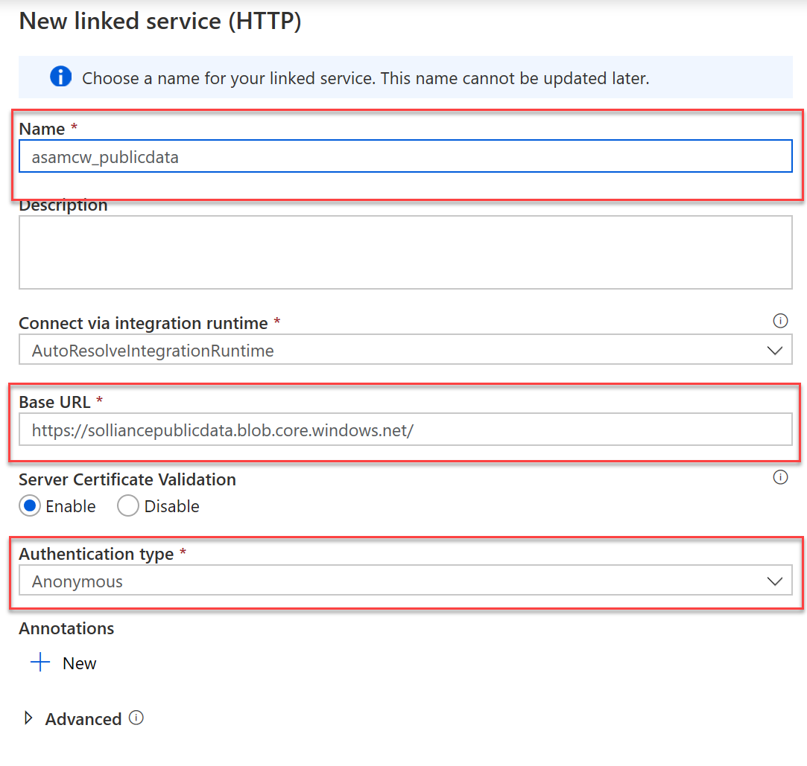
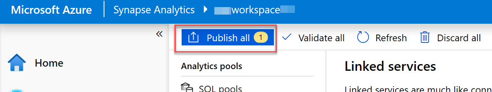

<div class="MCWHeader1">
Azure Synapse Analytics end-to-end solution
</div>

<div class="MCWHeader2">
Hands-on lab step-by-step
</div>

<div class="MCWHeader3">
May 2020
</div>


Information in this document, including URL and other Internet Web site references, is subject to change without notice. Unless otherwise noted, the example companies, organizations, products, domain names, e-mail addresses, logos, people, places, and events depicted herein are fictitious, and no association with any real company, organization, product, domain name, e-mail address, logo, person, place or event is intended or should be inferred. Complying with all applicable copyright laws is the responsibility of the user. Without limiting the rights under copyright, no part of this document may be reproduced, stored in or introduced into a retrieval system, or transmitted in any form or by any means (electronic, mechanical, photocopying, recording, or otherwise), or for any purpose, without the express written permission of Microsoft Corporation.

Microsoft may have patents, patent applications, trademarks, copyrights, or other intellectual property rights covering subject matter in this document. Except as expressly provided in any written license agreement from Microsoft, the furnishing of this document does not give you any license to these patents, trademarks, copyrights, or other intellectual property.

The names of manufacturers, products, or URLs are provided for informational purposes only and Microsoft makes no representations and warranties, either expressed, implied, or statutory, regarding these manufacturers or the use of the products with any Microsoft technologies. The inclusion of a manufacturer or product does not imply endorsement of Microsoft of the manufacturer or product. Links may be provided to third party sites. Such sites are not under the control of Microsoft and Microsoft is not responsible for the contents of any linked site or any link contained in a linked site, or any changes or updates to such sites. Microsoft is not responsible for webcasting or any other form of transmission received from any linked site. Microsoft is providing these links to you only as a convenience, and the inclusion of any link does not imply endorsement of Microsoft of the site or the products contained therein.

© 2020 Microsoft Corporation. All rights reserved.

Microsoft and the trademarks listed at <https://www.microsoft.com/en-us/legal/intellectualproperty/Trademarks/Usage/General.aspx> are trademarks of the Microsoft group of companies. All other trademarks are property of their respective owners.

**Contents** 

<!-- TOC -->
- [Azure Synapse Analytics end-to-end solution hands-on lab step-by-step](#azure-synapse-analytics-end-to-end-solution-hands-on-lab-step-by-step)
  - [Abstract and learning objectives](#abstract-and-learning-objectives)
  - [Overview](#overview)
  - [Solution architecture](#solution-architecture)
  - [Requirements](#requirements)
  - [Before the hands-on lab](#before-the-hands-on-lab)
  - [Resource naming throughout this lab](#resource-naming-throughout-this-lab)
  - [Exercise 1: Accessing the Azure Synapse Analytics workspace](#exercise-1-accessing-the-azure-synapse-analytics-workspace)
    - [Task 1: Launching Synapse Studio](#task-1-launching-synapse-studio)
  - [Exercise 2: Create and populate customer information and sales tables in the SQL Pool](#exercise-2-create-and-populate-customer-information-and-sales-tables-in-the-sql-pool)
    - [Task 1: Create an HTTP linked service to obtain raw data](#task-1-create-an-http-linked-service-to-obtain-raw-data)
    - [Task 2: Create supporting tables in the SQL Pool](#task-2-create-supporting-tables-in-the-sql-pool)
  - [Exercise 5 - Security](#exercise-5---security)
    - [Task 1 - Column level security](#task-1---column-level-security)
    - [Task 2 - Row level security](#task-2---row-level-security)
    - [Task 3 - Dynamic data masking](#task-3---dynamic-data-masking)
  - [After the hands-on lab](#after-the-hands-on-lab)
<!-- /TOC -->

# Azure Synapse Analytics end-to-end solution hands-on lab step-by-step

## Abstract and learning objectives

In this hands-on-lab, you will build an end-to-end data analytics with machine learning solution using Azure Synapse Analytics. The information will be presented in the context of a retail scenario. We will be heavily leveraging Azure Synapse Studio, a tool that conveniently unifies the most common data operations from ingestion, transformation, querying, and visualization.

## Overview

TODO: at the end make sure we include an outline of features used in this lab

## Solution architecture

TODO: at the end make sure we include diagram of all features of this lab

## Requirements

1. Microsoft Azure subscription

## Before the hands-on lab

Refer to the Before the hands-on lab setup guide manual before continuing to the lab exercises.

## Resource naming throughout this lab

For the remainder of this guide, the following terms will be used for various ASA-related resources (make sure you replace them with actual names and values from your environment):

| Azure Synapse Analytics Resource  | To be referred to                                                                  |
|-----------------------------------|------------------------------------------------------------------------------------|
| Azure Subscription                | `WorkspaceSubscription`                                                            |
| Azure Region                      | `WorkspaceRegion`                                                                  |
| Workspace resource group          | `WorkspaceResourceGroup`                                                           |
| Workspace / workspace name        | `Workspace`                                                                        |
| Primary Storage Account           | `PrimaryStorage`                                                                   |
| Default file system container     | `DefaultFileSystem`                                                                |
| SQL Pool                          | `SqlPool01`                                                                        |
| SQL Serverless Endpoint           | `SqlServerless01`                                                                  |
| Azure Key Vault                   | `KeyVault01`                                                                       |

## Exercise 1: Accessing the Azure Synapse Analytics workspace

All exercises in this lab utilize the workspace Synapse Studio user interface. This exercise will outline the steps to launch Synapse Studio. Unless otherwise specified, all instruction including menu navigation will occur in Synapse Studio.

### Task 1: Launching Synapse Studio

1. Log into the [Azure Portal](https://portal.azure.com).

2. Expand the left menu, and select the **Resource groups** item.
  
    

3. From the list of resource groups, select `WorkspaceResourceGroup`.
  
4. From the list of resources, select the **Synapse Workspace** resource, `Workspace`.
  
    

5. On the **Overview** tab of the Synapse Workspace page, select the **Launch Synapse Studio** item from the top toolbar. Alternatively you can select the Workspace web URL link.

    

## Exercise 2: Create and populate customer information and sales tables in the SQL Pool

Duration: X minutes

The first step in querying meaningful data is to create tables to house the data. In this case, we will create two different tables: CustomerInfo and Sales. When designing tables in Azure Synapse Analytics, we need to take into account the expected amount of data in each table, as well as how each table will be used. Utilize the following guidance when designing your tables to ensure the best experience and performance.

Table design performance considerations

| Table Indexing | Recommended use |
|--------------|-------------|
| Clustered Columnstore | recommended for tables with greater than 100 million rows, offers the highest data compression with best overall query performance |
| Heap Tables | Smaller tables with less than 100 million rows, commonly used as a staging table prior to transformation |
| Clustered Index | large lookup tables (> 100 million rows) where querying will only result in a single row returned |
| Clustered Index + non-clustered secondary index | large tables (> 100 million rows) when single (or very few) records are being returned in queries |

| Table Distribution/Partition Type | Recommended use |
|--------------------|-------------|
| Hash distribution | tables that are larger than 2 GBs with infrequent insert/update/delete operations, works well for large fact tables in a star schema |
| Round robin distribution | default distribution, when little is known about the data or how it will be used. Use this distribution for staging tables |
| Replicated tables | smaller lookup tables less than 1.5 GB in size |

### Task 1: Create an HTTP linked service to obtain raw data

Linked Services are synonymous with connection strings in Azure Synapse Analytics. Azure Synapse Analytics linked services provides the ability to connect to nearly 100 different types of external services ranging from Azure Storage Accounts to Amazon S3 and more. In this exercise, we will be pulling raw data that is housed in CSV format from a public HTTP endpoint. We will need to create a Linked Service to define the location where this data will be obtained.

1. Expand the left menu and select the **Manage** item.

    

2. From the secondary menu, beneath **External connections** select **Linked services**.

    

3. On the **Linked services** screen, select **+ New** from the toolbar menu.

    

4. On the **New linked service** blade, select the **File** tab and the **HTTP** item; then select **Continue**.

    

5. On the **New linked service (HTTP)** blade, fill the form as follows, then select **Create**:
  
   | Field | Value |
   |-------|-------|
   | Name  | Enter `asamcw_publicdata` |
   | Base URL | Enter `https://solliancepublicdata.blob.core.windows.net/` |
   | Authentication type | Select **Anonymous** |

   

6. On the **Manage** screen toolbar, you should now see one change that hasn't been published. Select the **Publish all** button to publish the new linked service.

    

7. In the Publish all blade, select the **Publish** button to commit the changes.

### Task 2: Create supporting tables in the SQL Pool

Over the past 5 years, Wide World Importers has amassed over 3 billion rows of sales data. With this quantity of data, the customer information lookup table is estimated to have over 100 million rows but will consume less than 1.5 GB of storage. While we will be using only a subset of this data for the lab, we will design the table for the production environment. Using the guidance outlined in the task description, we can ascertain that we will need a **Clustered Columnstore** table with a **Replicated** table distribution to hold customer data.

1. Create the customer information table
  
   ```sql

    CREATE TABLE [wwi_mcw].[CustomerInfo]
    (
      [UserName] [nvarchar](100)  NULL,
      [Gender] [nvarchar](10)  NULL,
      [Phone] [nvarchar](50)  NULL,
      [Email] [nvarchar](150)  NULL,
      [CreditCard] [nvarchar](21)  NULL
    )
    WITH
    (
      DISTRIBUTION = REPLICATE,
      CLUSTERED COLUMNSTORE INDEX
    )
    GO
   ```

2. Create the campaign analytics table

    ```sql
    CREATE TABLE [wwi_mcw].[CampaignAnalytics]
    (
        [Region] [nvarchar](50)  NOT NULL,
        [Country] [nvarchar](30)  NOT NULL,
        [ProductCategory] [nvarchar](50)  NOT NULL,
        [CampaignName] [nvarchar](500)  NOT NULL,
        [Revenue] [decimal](10,2)  NULL,
        [RevenueTarget] [decimal](10,2)  NULL,
        [City] [nvarchar](50)  NULL,
        [State] [nvarchar](25)  NULL
    )
    WITH
    (
        DISTRIBUTION = HASH ( [Region] ),
        CLUSTERED COLUMNSTORE INDEX
    )
    ```
  
3. Create the sale table

  ```sql
    CREATE TABLE [wwi_mcw].[SaleSmall]
    (
      [TransactionId] [uniqueidentifier]  NOT NULL,
      [CustomerId] [int]  NOT NULL,
      [ProductId] [smallint]  NOT NULL,
      [Quantity] [tinyint]  NOT NULL,
      [Price] [decimal](9,2)  NOT NULL,
      [TotalAmount] [decimal](9,2)  NOT NULL,
      [TransactionDateId] [int]  NOT NULL,
      [ProfitAmount] [decimal](9,2)  NOT NULL,
      [Hour] [tinyint]  NOT NULL,
      [Minute] [tinyint]  NOT NULL,
      [StoreId] [smallint]  NOT NULL
    )
    WITH
    (
      DISTRIBUTION = HASH ( [CustomerId] ),
      CLUSTERED COLUMNSTORE INDEX,
      PARTITION
      (
        [TransactionDateId] RANGE RIGHT FOR VALUES (
          20100101, 20100201, 20100301, 20100401, 20100501, 20100601, 20100701, 20100801, 20100901, 20101001, 20101101, 20101201, 
          20110101, 20110201, 20110301, 20110401, 20110501, 20110601, 20110701, 20110801, 20110901, 20111001, 20111101, 20111201, 
          20120101, 20120201, 20120301, 20120401, 20120501, 20120601, 20120701, 20120801, 20120901, 20121001, 20121101, 20121201, 
          20130101, 20130201, 20130301, 20130401, 20130501, 20130601, 20130701, 20130801, 20130901, 20131001, 20131101, 20131201, 
          20140101, 20140201, 20140301, 20140401, 20140501, 20140601, 20140701, 20140801, 20140901, 20141001, 20141101, 20141201, 
          20150101, 20150201, 20150301, 20150401, 20150501, 20150601, 20150701, 20150801, 20150901, 20151001, 20151101, 20151201, 
          20160101, 20160201, 20160301, 20160401, 20160501, 20160601, 20160701, 20160801, 20160901, 20161001, 20161101, 20161201, 
          20170101, 20170201, 20170301, 20170401, 20170501, 20170601, 20170701, 20170801, 20170901, 20171001, 20171101, 20171201, 
          20180101, 20180201, 20180301, 20180401, 20180501, 20180601, 20180701, 20180801, 20180901, 20181001, 20181101, 20181201, 
          20190101, 20190201, 20190301, 20190401, 20190501, 20190601, 20190701, 20190801, 20190901, 20191001, 20191101, 20191201)
      )
    )
  ```

## Exercise 5 - Security

It is important to identify data columns of that hold sensitive information. Types of sensitive could be social security numbers, email addresses, credit card numbers, financial totals, and more. Azure Synapse Analytics allows you define permissions that prevent users or roles select privileges on specific columns.

### Task 1 - Column level security

  ```sql
      /*  Column-level security feature in Azure Synapse simplifies the design and coding of security in applications.
        It ensures column level security by restricting column access to protect sensitive data. */

    /* Scenario: In this scenario we will be working with two users. The first one is the CEO, he has access to all
        data. The second one is DataAnalystMiami, this user doesn't have access to the confidential Revenue column
        in the CampaignAnalytics table. Follow this lab, one step at a time to see how Column-level security removes access to the
        Revenue column to DataAnalystMiami */

    --Step 1: Let us see how this feature in Azure Synapse works. Before that let us have a look at the Campaign Analytics table.
    select  Top 100 * from wwi_mcw.CampaignAnalytics
    where City is not null and state is not null

    /*  Consider a scenario where there are two users.
        A CEO, who is an authorized  personnel with access to all the information in the database
        and a Data Analyst, to whom only required information should be presented.*/

    -- Step:2 Verify the existence of the “CEO” and “DataAnalystMiami” users in the Datawarehouse.
    SELECT Name as [User1] FROM sys.sysusers WHERE name = N'CEO';
    SELECT Name as [User2] FROM sys.sysusers WHERE name = N'DataAnalystMiami';


    -- Step:3 Now let us enforcing column level security for the DataAnalystMiami.
    /*  The CampaignAnalytics table in the warehouse has information like ProductID, Analyst, CampaignName, Quantity, Region, State, City, RevenueTarget and Revenue.
        The Revenue generated from every campaign is classified and should be hidden from DataAnalystMiami.
    */

    REVOKE SELECT ON wwi_mcw.CampaignAnalytics FROM DataAnalystMiami;
    GRANT SELECT ON wwi_mcw.CampaignAnalytics([ProductID], [Analyst], [Product], [CampaignName],[Quantity], [Region], [State], [City], [RevenueTarget]) TO DataAnalystMiami;
    -- This provides DataAnalystMiami access to all the columns of the Sale table but Revenue.

    -- Step:4 Then, to check if the security has been enforced, we execute the following query with current User As 'DataAnalystMiami', this will result in an error
    --  since DataAnalystMiami doesn't have select access to the Revenue column
    EXECUTE AS USER ='DataAnalystMiami';
    select TOP 100 * from wwi_mcw.CampaignAnalytics;
    ---
    -- The following query will succeed since we are not including the Revenue column in the query.
    EXECUTE AS USER ='DataAnalystMiami';
    select [ProductID], [Analyst], [Product], [CampaignName],[Quantity], [Region], [State], [City], [RevenueTarget] from wwi_mcw.CampaignAnalytics;

    -- Step:5 Whereas, the CEO of the company should be authorized with all the information present in the warehouse.To do so, we execute the following query.
    Revert;
    GRANT SELECT ON wwi_mcw.CampaignAnalytics TO CEO;  --Full access to all columns.

    -- Step:6 Let us check if our CEO user can see all the information that is present. Assign Current User As 'CEO' and the execute the query
    EXECUTE AS USER ='CEO'
    select * from wwi_mcw.CampaignAnalytics
    Revert;
  ```

### Task 2 - Row level security

  ```sql
    /* Row level Security (RLS) in Azure Synapse enables us to use group membership to control access to rows in a table.
    Azure Synapse applies the access restriction every time the data access is attempted from any user. 
    Let see how we can implement row level security in Azure Synapse.*/

  ----------------------------------Row-Level Security (RLS), 1: Filter predicates------------------------------------------------------------------
  -- Step:1 The Sale table has two Analyst values: DataAnalystMiami and DataAnalystSanDiego. 
  --     Each analyst has jurisdiction across a specific Region. DataAnalystMiami on the South East Region
  --      and DataAnalystSanDiego on the Far West region.
  SELECT DISTINCT Analyst, Region FROM wwi_mcw.CampaignAnalytics order by Analyst ;

  /* Scenario: WWI requires that an Analyst only see the data for their own data from their own region. The CEO should see ALL data.
      In the Sale table, there is an Analyst column that we can use to filter data to a specific Analyst value. */

  /* We will define this filter using what is called a Security Predicate. This is an inline table-valued function that allows
      us to evaluate additional logic, in this case determining if the Analyst executing the query is the same as the Analyst
      specified in the Analyst column in the row. The function returns 1 (will return the row) when a row in the Analyst column is the same as the user executing the query (@Analyst = USER_NAME()) or if the user executing the query is the CEO user (USER_NAME() = 'CEO')
      whom has access to all data.
  */

  -- Review any existing security predicates in the database
  SELECT * FROM sys.security_predicates

  --Step:2 Create a new Schema to hold the security predicate, then define the predicate function. It returns 1 (or True) when
  --  a row should be returned in the parent query.
  GO
  CREATE SCHEMA Security
  GO
  CREATE FUNCTION Security.fn_securitypredicate(@Analyst AS sysname)  
      RETURNS TABLE  
  WITH SCHEMABINDING  
  AS  
      RETURN SELECT 1 AS fn_securitypredicate_result
      WHERE @Analyst = USER_NAME() OR USER_NAME() = 'CEO'
  GO
  -- Now we define security policy that adds the filter predicate to the Sale table. This will filter rows based on their login name.
  CREATE SECURITY POLICY SalesFilter  
  ADD FILTER PREDICATE Security.fn_securitypredicate(Analyst)
  ON wwi_mcw.CampaignAnalytics
  WITH (STATE = ON);

  ------ Allow SELECT permissions to the Sale Table.------
  GRANT SELECT ON wwi_mcw.CampaignAnalytics TO CEO, DataAnalystMiami, DataAnalystSanDiego;

  -- Step:3 Let us now test the filtering predicate, by selecting data from the Sale table as 'DataAnalystMiami' user.
  EXECUTE AS USER = 'DataAnalystMiami'
  SELECT * FROM wwi_mcw.CampaignAnalytics;
  revert;
  -- As we can see, the query has returned rows here Login name is DataAnalystMiami

  -- Step:4 Let us test the same for  'DataAnalystSanDiego' user.
  EXECUTE AS USER = 'DataAnalystSanDiego';
  SELECT * FROM wwi_mcw.CampaignAnalytics;
  revert;
  -- RLS is working indeed.

  -- Step:5 The CEO should be able to see all rows in the table.
  EXECUTE AS USER = 'CEO';  
  SELECT * FROM wwi_mcw.CampaignAnalytics;
  revert;
  -- And he can.

  --Step:6 To disable the security policy we just created above, we execute the following.
  ALTER SECURITY POLICY SalesFilter  
  WITH (STATE = OFF);

  DROP SECURITY POLICY SalesFilter;
  DROP FUNCTION Security.fn_securitypredicate;
  DROP SCHEMA Security;
  ```

### Task 3 - Dynamic data masking

```sql
    -------------------------------------------------------------------------Dynamic Data Masking (DDM)----------------------------------------------------------------------------------------------------------
    /*  Dynamic data masking helps prevent unauthorized access to sensitive data by enabling customers
        to designate how much of the sensitive data to reveal with minimal impact on the application layer.
        Let see how */

    /* Scenario: WWI has identified sensitive information in the CustomerInfo table. They would like us to
        obfuscate the CreditCard and Email columns of the CustomerInfo table to DataAnalysts */

    -- Step:1 Let us first get a view of CustomerInfo table.
    SELECT TOP (100) * FROM wwi_mcw.CustomerInfo;

    -- Step:2 Let's confirm that there are no Dynamic Data Masking (DDM) applied on columns.
    SELECT c.name, tbl.name as table_name, c.is_masked, c.masking_function  
    FROM sys.masked_columns AS c  
    JOIN sys.tables AS tbl
        ON c.[object_id] = tbl.[object_id]  
    WHERE is_masked = 1
        AND tbl.name = 'CustomerInfo';
    -- No results returned verify that no data masking has been done yet.

    -- Step:3 Now lets mask 'CreditCard' and 'Email' Column of 'CustomerInfo' table.
    ALTER TABLE wwi_mcw.CustomerInfo  
    ALTER COLUMN [CreditCard] ADD MASKED WITH (FUNCTION = 'partial(0,"XXXX-XXXX-XXXX-",4)');
    GO
    ALTER TABLE wwi_mcw.CustomerInfo
    ALTER COLUMN Email ADD MASKED WITH (FUNCTION = 'email()');
    GO
    -- The columns are sucessfully masked.

    -- Step:4 Let's see Dynamic Data Masking (DDM) applied on the two columns.
    SELECT c.name, tbl.name as table_name, c.is_masked, c.masking_function  
    FROM sys.masked_columns AS c  
    JOIN sys.tables AS tbl
        ON c.[object_id] = tbl.[object_id]  
    WHERE is_masked = 1
        AND tbl.name ='CustomerInfo';

    -- Step:5 Now, let us grant SELECT permission to 'DataAnalystMiami' on the 'CustomerInfo' table.
   GRANT SELECT ON wwi_mcw.CustomerInfo TO DataAnalystMiami;  

    -- Step:6 Logged in as  'DataAnalystMiami' let us execute the select query and view the result.
    EXECUTE AS USER = 'DataAnalystMiami';  
    SELECT * FROM wwi_mcw.CustomerInfo;

    -- Step:7 Let us remove the data masking using UNMASK permission
    GRANT UNMASK TO DataAnalystMiami;
    EXECUTE AS USER = 'DataAnalystMiami';  
    SELECT *
    FROM wwi_mcw.CustomerInfo;
    revert;
    REVOKE UNMASK TO DataAnalystMiami;  

    ----step:8 Reverting all the changes back to as it was.
    ALTER TABLE wwi_mcw.CustomerInfo
    ALTER COLUMN CreditCard DROP MASKED;
    GO
    ALTER TABLE wwi_mcw.CustomerInfo
    ALTER COLUMN Email DROP MASKED;
    GO
```

## After the hands-on lab

Duration: X minutes

You should follow all steps provided *after* attending the Hands-on lab.
