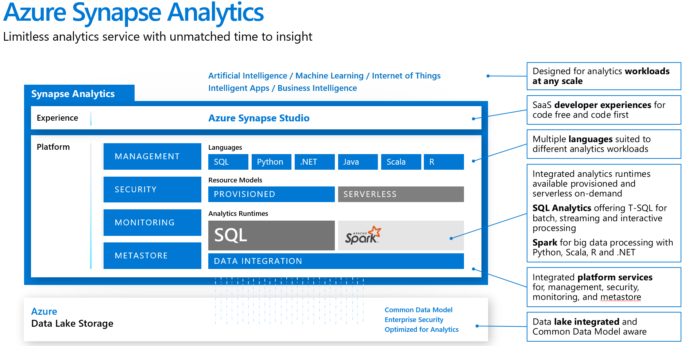

Azure Synapse Analytics

Whiteboard design session student guide

March 2020

Information in this document, including URL and other Internet Web site references, is subject to change without notice. Unless otherwise noted, the example companies, organizations, products, domain names, e-mail addresses, logos, people, places, and events depicted herein are fictitious, and no association with any real company, organization, product, domain name, e-mail address, logo, person, place or event is intended or should be inferred. Complying with all applicable copyright laws is the responsibility of the user. Without limiting the rights under copyright, no part of this document may be reproduced, stored in or introduced into a retrieval system, or transmitted in any form or by any means (electronic, mechanical, photocopying, recording, or otherwise), or for any purpose, without the express written permission of Microsoft Corporation.

Microsoft may have patents, patent applications, trademarks, copyrights, or other intellectual property rights covering subject matter in this document. Except as expressly provided in any written license agreement from Microsoft, the furnishing of this document does not give you any license to these patents, trademarks, copyrights, or other intellectual property.

The names of manufacturers, products, or URLs are provided for informational purposes only and Microsoft makes no representations and warranties, either expressed, implied, or statutory, regarding these manufacturers or the use of the products with any Microsoft technologies. The inclusion of a manufacturer or product does not imply endorsement of Microsoft of the manufacturer or product. Links may be provided to third party sites. Such sites are not under the control of Microsoft and Microsoft is not responsible for the contents of any linked site or any link contained in a linked site, or any changes or updates to such sites. Microsoft is not responsible for webcasting or any other form of transmission received from any linked site. Microsoft is providing these links to you only as a convenience, and the inclusion of any link does not imply endorsement of Microsoft of the site or the products contained therein.

© 2020 Microsoft Corporation. All rights reserved.

Microsoft and the trademarks listed at <https://www.microsoft.com/en-us/legal/intellectualproperty/Trademarks/Usage/General.aspx> are trademarks of the Microsoft group of companies. All other trademarks are property of their respective owners.

**Contents**

<!-- TOC -->

- [Azure Synapse Analytics whiteboard design session student guide](#azure-synapse-analytics-whiteboard-design-session-student-guide)
  - [Abstract and learning objectives](#abstract-and-learning-objectives)
  - [Step 1: Review the customer case study](#step-1-review-the-customer-case-study)
    - [Customer situation](#customer-situation)
    - [Customer needs](#customer-needs)
    - [Customer objections](#customer-objections)
    - [Infographic for common scenarios](#infographic-for-common-scenarios)
  - [Step 2: Design a proof of concept solution](#step-2-design-a-proof-of-concept-solution)
  - [Step 3: Present the solution](#step-3-present-the-solution)
  - [Wrap-up](#wrap-up)
  - [Additional references](#additional-references)

<!-- /TOC -->

# Azure Synapse Analytics whiteboard design session student guide

## Abstract and learning objectives 

This workshop will challenged students to know about the breadth of functionality available within Azure Synapse Analytics, as well to learn how to best configure a comprehensive advanced analytics solution for an enterprise customer in the retail space.

## Step 1: Review the customer case study 

**Outcome**

Analyze your customer's needs.

Timeframe: 15 minutes

Directions: With all participants in the session, the facilitator/SME presents an overview of the customer case study along with technical tips.

1.  Meet your table participants and trainer.

2.  Read all of the directions for steps 1-3 in the student guide.

3.  As a table team, review the following customer case study.

### Customer situation

Wide World Importers, WWI, has hundreds of brick and mortar stores and an online store where they sell a variety of products. 

WWI believes that data is the oxygen of retail. Retail has never been short of data, but they have not been able to maximize the value of this data. They struggle with fragmented data and a lack of understanding of customer behavior and expectations and believe that a successful customer experience strategy is founded upon the effective use of data. 

They understand that using analytics on top of retail data has the potential to unlock ways for them to improve personalized, omni-channel campaigns that engage potential and existing customers across their buying journey. 

They would like to combine their retail lifecycle data including customer data, operations data, sourcing and supplier data as well as transaction data with analytics to reduce churn, enhance loyalty, advance customer journeys, enable the ability to conduct contextual marketing, measure attribution and provide insights across their enterprise to holistically drive growth across the organization. 

They are looking to use historical campaign and customer analytics data and make decisions for the present. Beyond these large historical data sets, they would like to use streaming tweet data from Twitter as well as telemetry from IoT sensors in their brick and mortar locations. In effect, they would like to use data from the present moment to inform decisions for the next moment. WWI sees an opportunity to use their data to predict the future, intially by making product recommendations.

According to Peter Guerin, Chief Technical Officer (CTO), Wide World Importers has over 5 years of sales transaction data from Oracle, consisting of more than 30  billion rows. But that is not their only enteprise data source. They have finance data stored in SAP Hana, marketing data in Teradata and social media data coming in from Twitter. They need a solution that allows them to integrate, query over and analyze the data from all of these sources. Additionally, regardless of the volume, they want to be able to execute queries across such data with results returning in seconds.

In addition to those data sources, they have in-store IoT sensors producing telemetry data that tracks the traffic patterns of customers walking the aisles. Each store has 50 sensors, and they have 100 stores equipped to provide this real-time data. Using this data they want to understand in which departments (or groups of aisles) people are spending most of their time, and which of those they are not. They would like a solution to ensure that this data gets ingested and processed in near real time, allowing them to quickly identify patterns that can be shared between stores. For example, as stores open on the East Coast, patterns detected in early buying behavior could inform last minute offers and in store product placement of products in their West Coast stores that have yet to open.

WWI would like the option to enable their specialists to create data ingest and data transformation pipelines with or without code. They would like to accomplish this using tools that simplify the building of these transformation pipelines using a graphical designer, while also allowing their team to implement with code when preferred by their team.

Peter also mentioned that, in his experience, a point of frustration with the tools was how much setup was required before any preliminary exploratory data analysis could be performed. So he would prefer a solution that allows WWI to quickly explore the raw ingested data to understand its contents.

To bring their entire operation into perspective, Wide World Importers would like to create a dashboard where they can see their KPI's derived from historical data, real-time twitter sentiment and IoT sensor data, and key product recommendations generated using machine learning.

### Customer needs 

1.  Gain business insights using a combination of historical, real-time, and predictive analytics. 

2.  Have a unified approach to handling their structured and unstructured data sources.

3.  Enable their team of data engineers and data scientists to bring in and run complex queries over petabytes of structured data with billions of rows and unstructured enterprise operational data.

4.  Enable business analysts and data science/data engineering teams to share a single source of truth. 

5.  They would like to minimize the number of disparate services they use across ingest, transformation, querying and storage, so that their team of data engineers, data scientists and database administrators can master one tool, and can build shared best practices for development, management and monitoring.

6.  Prefer to accomplish this working withing a single collaborative environment.

7.  They have concerns about performance, and want to make sure they can understand the core approaches they should take to ensure the best performance of the solution recommended.

8.  Need a solution that provides a consistent security model across all components.

### Customer objections 

1.  WWI understands that Azure offers several services with overlapping capabilities- they do not want to spend the time stitching them together to get to the desired analytics solution. 

2.  The have seen demos from competing systems that claim to load massive datasets in seconds. Does Azure offer such a solution?

3.  Can they really minimize the number of disparate services they use across ingest, transformation, querying and storage, so that their team of data engineers, data scientists and database administrators can master one tool, and can build shared best practices for development, management and monitoring?

4.  They have heard of serverless querying, does your solution offer this? Does it support querying the data at the scale of WWI and what formats does it support? Would this be appropriate for supporting their dashboards or reports?

5.  If their solution provide serverless querying, are they prevented from using pre-allocated query resources? 

6.  Is my data protected at rest and do I have control over the keys used to encrypt it?

### Infographic for common scenarios

## Step 2: Design a proof of concept solution

**Outcome**

Design a solution and prepare to present the solution to the target customer audience in a 15-minute chalk-talk format.

Timeframe: 60 minutes

**Business needs**

Directions: With all participants at your table, answer the following questions and list the answers on a flip chart:

1.  Who should you present this solution to? Who is your target customer audience? Who are the decision makers?

2.  What customer business needs do you need to address with your solution?

**Design**

Directions: With all participants at your table, respond to the following questions on a flip chart:

*High Level Architecture*

1.	Diagram your initial vision for handling the top-level requirements for data loading, data transformation, storage, machine learning modeling, and reporting.

*Ingest & Store*

1.	For the solution you recommend, what specific approach would you say to WWI is the most performant for moving flat file data from the ingest storage locations to the data lake? 

2.	What storage service would you recommend they use and how would you recommend they structure the folders so they can manage the data at the various levels of refinement?

3.	When it comes to ingesting raw data in batch from new data sources, what data formats could they support with your solution?

4.	How will you ingest streaming data from the in-store IoT devices?

*Transform*

1.	Before building transformation pipelines or loading it into the data warehouse, how can WWI quickly explore the raw ingested data to understand its contents?

2.	When it comes to storing refined versions of the data for possible querying, what data format would you recommend they use? Why?

3.	Regarding the service you recommend they use for preparing, merging and transforming the data, in which situations can they use the graphical designer and which situations would require code? 

4.	Their data team is accustomed to leveraging open source packages that help them quickly pre-process the data, as well as enable their data scientists to train machine learning models using both Spark and Python. Explain how your solution would enable this.

5.	Does your solution allow their data engineers and data scientists to work within Jupyter notebooks? How are libraries managed?

*Query*

Their sales transaction dataset exceeds a billion rows. For their downstream reporting queries, they need to be able to join, project and filter these rows in no longer than 10s of seconds. WWI is concerned their data is just too big to do this.

1.	What specific indexing techniques should they use to reach this kind of performance for their fact tables? Why?

2.	Would you recommend the same approach for tables they have with less than 100 million rows?

3.	How should they configure indexes on their smaller lookup tables (e.g., those that contain store names and addresses)?

4.	What would you suggest for their larger lookup tables that are used just for point lookups that retrieve only a single row? How could they makes these more flexible so that queries filtering against different sets of columns would still yield performant lookups?

5.	What should they use for the fastest loading of staging tables?
  
6.	What are the typical issues they should look out for with regards to **distributed** table design for the following scenarios? 
    * Their smallest fact table exceeds several GB’s and by their nature experiences frequent inserts. 
      
    *	As they develop the data warehouse, the WWI data team identified some tables created from the raw input that might be useful, but they don’t currently join to other tables and they are not sure of the best columns they should use for distributing the data. 
       
    *	 Their data engineers sometimes use temporary staging tables in their data preparation. 

7.	Some of their data contains columns in the JSON format, how could they flatten these hierarchical fields to a tabular structure? 

8.	What approach can they use to update the JSON data?

9.	In some of their queries, they are OK trading off speed of returning counts for a small reduction in accuracy. How might they do this?

10.	Their downstream reports are used by many users, which often means the same query is being executed repeatedly against data that does not change that often. What can WWI to improve the performance of these types of queries? How does this approach work when the underlying data changes?

*Visualize*

1.	What product can WWI use to visualize their retail transaction data? Is it a separate tool that they need to install? 

2.	Can they use this same tool to visualize both the batch and streaming data in a single dashboard view?

3.	With the product you recommend, do they need to load all the data into the data warehouse before they can create reports against it?

*Manage*

1.	In previous efforts, WWI systems struggled with their popularity. Exploratory queries that were not time sensitive would saturate the available resources and delay the execution of higher priority queries supporting critical reports. Explain how your solution helps to resolve this. 

2.	What does your solution provide to WWI to help them identify issues such as suboptimal table distribution, data skew, cache misses, tempdb contention and suboptimal plan selection?

3.	WWI recognizes there is a balance between the data warehouse software staying up to date and when they can afford downtime that might result. How can they establish their preferences with your solution so they are never caught off guard with an upgrade?

*Secure*

1.	How does your solution provide unified authentication, such as across SQL and Spark workloads? 

2.	How is access to data authorized for data stored in Azure Data Lake Store gen 2? In SQL Pool databases?

3.	One of WWI's challenges is that while multiple departments might be able to query a given table, what data they should be allowed to see depends on their department or role within the company. How could your solution support this? You should suggest three options. 

4.	Can the solution help WWI discover, track and remediate security misconfigurations and detect threats? How?

5.	Can WWI use this same solution to monitor for sensitive information by enabling them to discover, classify and protect and track access to such data?
 
6.	From a network security standpoint, how should your solution be secured?

**Prepare**

Directions: With all participants at your table:

1.  Identify any customer needs that are not addressed with the proposed solution.

2.  Identify the benefits of your solution.

3.  Determine how you will respond to the customer's objections.

Prepare a 15-minute chalk-talk style presentation to the customer.

## Step 3: Present the solution

**Outcome**

Present a solution to the target customer audience in a 15-minute chalk-talk format.

Timeframe: 30 minutes

**Presentation**

Directions:

1.  Pair with another table.

2.  One table is the Microsoft team and the other table is the customer.

3.  The Microsoft team presents their proposed solution to the customer.

4.  The customer makes one of the objections from the list of objections.

5.  The Microsoft team responds to the objection.

6.  The customer team gives feedback to the Microsoft team.

7.  Tables switch roles and repeat Steps 2-6.

##  Wrap-up 

Timeframe: 15 minutes

Directions: Tables reconvene with the larger group to hear the facilitator/SME share the preferred solution for the case study.

##  Additional references

|    |            |
|----------|:-------------:|
| **Description** | **Links** |
| What is Azure Synapse Analytics  | https://docs.microsoft.com/en-us/azure/synapse-analytics/sql-data-warehouse/sql-data-warehouse-overview-what-is  |
| Cheat sheet for Azure Synapse Analytics solutions  | https://docs.microsoft.com/en-us/azure/synapse-analytics/sql-data-warehouse/cheat-sheet  |
| Azure Synapse Analytics FAQ  | https://docs.microsoft.com/en-us/azure/synapse-analytics/sql-data-warehouse/sql-data-warehouse-overview-faq  |
| Advanced data security for Azure SQL Database  | https://docs.microsoft.com/en-us/azure/sql-database/sql-database-advanced-data-security?toc=/azure/synapse-analytics/sql-data-warehouse/toc.json&bc=/azure/synapse-analytics/sql-data-warehouse/breadcrumb/toc.json  |
| Private link | https://docs.microsoft.com/en-us/azure/sql-database/sql-database-private-endpoint-overview?toc=/azure/synapse-analytics/sql-data-warehouse/toc.json&bc=/azure/synapse-analytics/sql-data-warehouse/breadcrumb/toc.json |
| Column-level security | https://docs.microsoft.com/en-us/azure/synapse-analytics/sql-data-warehouse/column-level-security |
| Row-level security | https://docs.microsoft.com/en-us/sql/relational-databases/security/row-level-security?toc=%2Fazure%2Fsynapse-analytics%2Fsql-data-warehouse%2Ftoc.json&bc=%2Fazure%2Fsynapse-analytics%2Fsql-data-warehouse%2Fbreadcrumb%2Ftoc.json&view=sql-server-ver15 |
| Dynamic Data Masking | https://docs.microsoft.com/en-us/azure/sql-database/sql-database-dynamic-data-masking-get-started?toc=%2Fazure%2Fsynapse-analytics%2Fsql-data-warehouse%2Ftoc.json&bc=%2Fazure%2Fsynapse-analytics%2Fsql-data-warehouse%2Fbreadcrumb%2Ftoc.json&view=sql-server-ver15 |
| Transparent Data Encryption | https://docs.microsoft.com/en-us/azure/sql-database/transparent-data-encryption-azure-sql?toc=%2Fazure%2Fsynapse-analytics%2Fsql-data-warehouse%2Ftoc.json&bc=%2Fazure%2Fsynapse-analytics%2Fsql-data-warehouse%2Fbreadcrumb%2Ftoc.json&view=sql-server-ver15&tabs=azure-portal |
| JSON Functions | https://docs.microsoft.com/en-us/sql/t-sql/functions/json-functions-transact-sql?toc=%2Fazure%2Fsynapse-analytics%2Fsql-data-warehouse%2Ftoc.json&bc=%2Fazure%2Fsynapse-analytics%2Fsql-data-warehouse%2Fbreadcrumb%2Ftoc.json&view=sql-server-ver15 |
| Result set caching |  https://docs.microsoft.com/en-us/azure/synapse-analytics/sql-data-warehouse/performance-tuning-result-set-caching?view=sql-server-ver15 |
| Overview of Tables in Synapse Analytics | https://docs.microsoft.com/en-us/azure/synapse-analytics/sql-data-warehouse/sql-data-warehouse-tables-overview?view=sql-server-ver15 |
| Workload Management | https://docs.microsoft.com/en-us/azure/synapse-analytics/sql-data-warehouse/sql-data-warehouse-workload-management?view=sql-server-ver15 |
| Intro to Azure Data Lake Store gen2 | https://docs.microsoft.com/en-us/azure/storage/blobs/data-lake-storage-introduction |
| Azure Stream Analytics | https://docs.microsoft.com/en-us/azure/stream-analytics/stream-analytics-introduction |