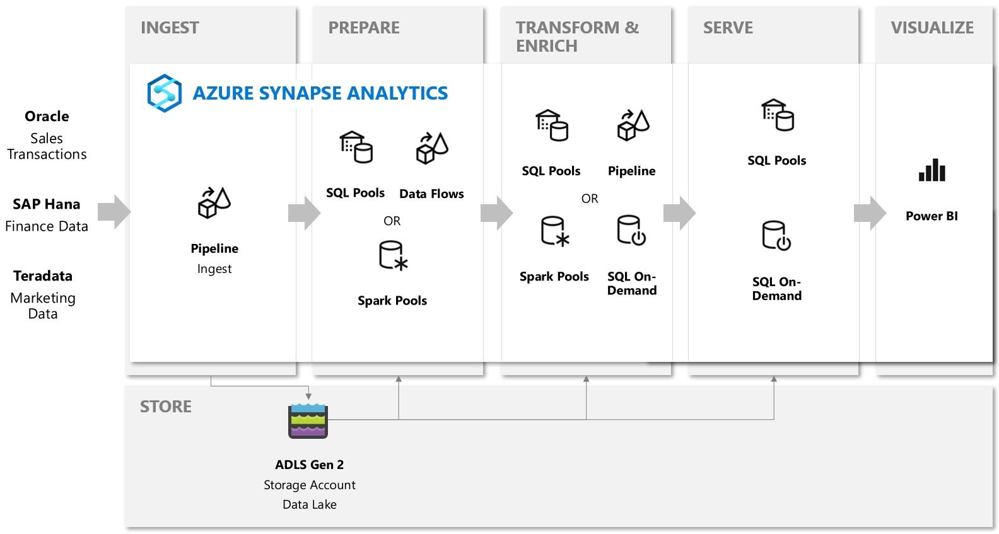

Azure Synapse Analytics

Whiteboard design session trainer guide

March 2020

Information in this document, including URL and other Internet Web site references, is subject to change without notice. Unless otherwise noted, the example companies, organizations, products, domain names, e-mail addresses, logos, people, places, and events depicted herein are fictitious, and no association with any real company, organization, product, domain name, e-mail address, logo, person, place or event is intended or should be inferred. Complying with all applicable copyright laws is the responsibility of the user. Without limiting the rights under copyright, no part of this document may be reproduced, stored in or introduced into a retrieval system, or transmitted in any form or by any means (electronic, mechanical, photocopying, recording, or otherwise), or for any purpose, without the express written permission of Microsoft Corporation.

Microsoft may have patents, patent applications, trademarks, copyrights, or other intellectual property rights covering subject matter in this document. Except as expressly provided in any written license agreement from Microsoft, the furnishing of this document does not give you any license to these patents, trademarks, copyrights, or other intellectual property.

The names of manufacturers, products, or URLs are provided for informational purposes only and Microsoft makes no representations and warranties, either expressed, implied, or statutory, regarding these manufacturers or the use of the products with any Microsoft technologies. The inclusion of a manufacturer or product does not imply endorsement of Microsoft of the manufacturer or product. Links may be provided to third party sites. Such sites are not under the control of Microsoft and Microsoft is not responsible for the contents of any linked site or any link contained in a linked site, or any changes or updates to such sites. Microsoft is not responsible for webcasting or any other form of transmission received from any linked site. Microsoft is providing these links to you only as a convenience, and the inclusion of any link does not imply endorsement of Microsoft of the site or the products contained therein.

© 2020 Microsoft Corporation. All rights reserved.

Microsoft and the trademarks listed at <https://www.microsoft.com/en-us/legal/intellectualproperty/Trademarks/Usage/General.aspx> are trademarks of the Microsoft group of companies. All other trademarks are property of their respective owners.

**Contents**

<!-- TOC -->

- [Trainer information](#trainer-information)
  - [Role of the trainer](#role-of-the-trainer)
  - [Whiteboard design session flow](#whiteboard-design-session-flow)
  - [Before the whiteboard design session: How to prepare](#before-the-whiteboard-design-session-how-to-prepare)
  - [During the whiteboard design session: Tips for an effective whiteboard design session](#during-the-whiteboard-design-session-tips-for-an-effective-whiteboard-design-session)
- [Azure Synapse Analytics whiteboard design session student guide](#azure-synapse-analytics-whiteboard-design-session-student-guide)
  - [Abstract and learning objectives](#abstract-and-learning-objectives)
  - [Step 1: Review the customer case study](#step-1-review-the-customer-case-study)
    - [Customer situation](#customer-situation)
    - [Customer needs](#customer-needs)
    - [Customer objections](#customer-objections)
    - [Infographic for common scenarios](#infographic-for-common-scenarios)
  - [Step 2: Design a proof of concept solution](#step-2-design-a-proof-of-concept-solution)
  - [Step 3: Present the solution](#step-3-present-the-solution)
  - [Wrap-up](#wrap-up)
  - [Additional references](#additional-references)
- [Azure Synapse Analytics whiteboard design session trainer guide](#azure-synapse-analytics-whiteboard-design-session-trainer-guide)
  - [Step 1: Review the customer case study](#step-1-review-the-customer-case-study-1)
  - [Step 2: Design a proof of concept solution](#step-2-design-a-proof-of-concept-solution-1)
  - [Step 3: Present the solution](#step-3-present-the-solution-1)
  - [Wrap-up](#wrap-up-1)
  - [Preferred target audience](#preferred-target-audience)
  - [Preferred solution](#preferred-solution)
  - [Checklist of preferred objection handling](#checklist-of-preferred-objection-handling)
  - [Customer quote (to be read back to the attendees at the end)](#customer-quote-to-be-read-back-to-the-attendees-at-the-end)

<!-- /TOC -->

# Trainer information

Thank you for taking time to support the whiteboard design sessions as a trainer!

## Role of the trainer

An amazing trainer:

- Creates a safe environment in which learning can take place.

- Stimulates the participant's thinking.

- Involves the participant in the learning process.

- Manages the learning process (on time, on topic, and adjusting to benefit participants).

- Ensures individual participant accountability.

- Ties it all together for the participant.

- Provides insight and experience to the learning process.

- Effectively leads the whiteboard design session discussion.

- Monitors quality and appropriateness of participant deliverables.

- Effectively leads the feedback process.

## Whiteboard design session flow 

Each whiteboard design session uses the following flow:

**Step 1: Review the customer case study (15 minutes)**

**Outcome**

Analyze your customer's needs.

- Customer's background, situation, needs and technical requirements

- Current customer infrastructure and architecture

- Potential issues, objectives and blockers

**Step 2: Design a proof of concept solution (60 minutes)**

**Outcome**

Design a solution and prepare to present the solution to the target customer audience in a 15-minute chalk-talk format.

- Determine your target customer audience.

- Determine customer's business needs to address your solution.

- Design and diagram your solution.

- Prepare to present your solution.

**Step 3: Present the solution (30 minutes)**

**Outcome**

Present solution to your customer:

- Present solution

- Respond to customer objections

- Receive feedback

**Wrap-up (15 minutes)**

- Review preferred solution

## Before the whiteboard design session: How to prepare

Before conducting your first whiteboard design session:

- Read the Student guide (including the case study) and Trainer guide.

- Become familiar with all key points and activities.

- Plan the point you want to stress, which questions you want to drive, transitions, and be ready to answer questions.

- Prior to the whiteboard design session, discuss the case study to pick up more ideas.

- Make notes for later.

## During the whiteboard design session: Tips for an effective whiteboard design session

**Refer to the Trainer guide** to stay on track and observe the timings.

**Do not expect to memorize every detail** of the whiteboard design session.

When participants are doing activities, you can **look ahead to refresh your memory**.

- **Adjust activity and whiteboard design session pace** as needed to allow time for presenting, feedback, and sharing.

- **Add examples, points, and stories** from your own experience. Think about stories you can share that help you make your points clearly and effectively.

- **Consider creating a "parking lot"** to record issues or questions raised that are outside the scope of the whiteboard design session or can be answered later. Decide how you will address these issues, so you can acknowledge them without being derailed by them.

***Have fun**! Encourage participants to have fun and share!*

**Involve your participants.** Talk and share your knowledge but always involve your participants, even while you are the one speaking.

**Ask questions** and get them to share to fully involve your group in the learning process.

**Ask first**, whenever possible. Before launching into a topic, learn your audience's opinions about it and experiences with it. Asking first enables you to assess their level of knowledge and experience, and leaves them more open to what you are presenting.

**Wait for responses**. If you ask a question such as, "What's your experience with (fill in the blank)?" then wait. Do not be afraid of a little silence. If you leap into the silence, your participants will feel you are not serious about involving them and will become passive. Give participants a chance to think, and if no one answers, patiently ask again. You will usually get a response.

# Azure Synapse Analytics whiteboard design session student guide

## Abstract and learning objectives

This workshop will challenge students to know about the breadth of functionality available within Azure Synapse Analytics, as well as to learn how to best configure a comprehensive advanced analytics solution for an enterprise customer in the retail space.

## Step 1: Review the customer case study

**Outcome**

Analyze your customer's needs.

Timeframe: 15 minutes

Directions:  With all participants in the session, the facilitator/SME presents an overview of the customer case study along with technical tips.

1. Meet your table participants and trainer.

2. Read all of the directions for steps 1-3 in the student guide.

3. As a table team, review the following customer case study.

### Customer situation

Wide World Importers (WWI) has hundreds of brick and mortar stores and an online store where they sell a variety of products.

WWI believes that data is the oxygen of retail. Retail has never been short of data, but they have not been able to maximize the value of this data. They struggle with fragmented data and a lack of understanding of customer behavior and expectations and believe that a successful customer experience strategy is founded upon the effective use of data.

They understand that using analytics on top of retail data has the potential to unlock ways for them to improve personalized, omni-channel campaigns that engage potential and existing customers across their buying journey.

They would like to combine their retail lifecycle data including customer data, operations data, sourcing and supplier data as well as transaction data with analytics to reduce churn, enhance loyalty, advance customer journeys, enable the ability to conduct contextual marketing, measure attribution and provide insights across their enterprise to holistically drive growth across the organization.

They are looking to use historical campaign and customer analytics data and make decisions for the present. Beyond these large historical data sets, they would like to use streaming tweet data from Twitter as well as telemetry from IoT sensors in their brick and mortar locations. In effect, they would like to use data from the present moment to inform decisions for the next moment. WWI sees an opportunity to use their data to predict the future, intially by making product recommendations.

According to Peter Guerin, Chief Technical Officer (CTO), Wide World Importers has over 5 years of sales transaction data from Oracle, consisting of more than 30  billion rows. But that is not their only enteprise data source. They have finance data stored in SAP Hana, marketing data in Teradata and social media data coming in from Twitter. They need a solution that allows them to integrate, query over and analyze the data from all of these sources. Additionally, regardless of the volume, they want to be able to execute queries across such data with results returning in seconds.

In addition to those data sources, they have in-store IoT sensors producing telemetry data that tracks the traffic patterns of customers walking the aisles. Each store has 50 sensors, and they have 100 stores equipped to provide this real-time data. Using this data they want to understand in which departments (or groups of aisles) people are spending most of their time, and which of those they are not. They would like a solution to ensure that this data gets ingested and processed in near real time, allowing them to quickly identify patterns that can be shared between stores. For example, as stores open on the East Coast, patterns detected in early buying behavior could inform last minute offers and in store product placement of products in their West Coast stores that have yet to open.

WWI would like the option to enable their specialists to create data ingest and data transformation pipelines with or without code. They would like to accomplish this using tools that simplify the building of these transformation pipelines using a graphical designer, while also allowing their team to implement with code when preferred by their team.

Peter also mentioned that, in his experience, a point of frustration with the tools was how much setup was required before any preliminary exploratory data analysis could be performed. So he would prefer a solution that allows WWI to quickly explore the raw ingested data to understand its contents.

To bring their entire operation into perspective, Wide World Importers would like to create a dashboard where they can see their KPI's derived from historical data, real-time twitter sentiment and IoT sensor data, and key product recommendations generated using machine learning.

### Customer needs 

1.  Gain business insights using a combination of historical, real-time, and predictive analytics. 

2.  Have a unified approach to handling their structured and unstructured data sources.

3.  Enable their team of data engineers and data scientists to bring in and run complex queries over petabytes of structured data with billions of rows and unstructured enterprise operational data.

4.  Enable business analysts and data science/data engineering teams to share a single source of truth. 

5.  They would like to minimize the number of disparate services they use across ingest, transformation, querying and storage, so that their team of data engineers, data scientists and database administrators can master one tool, and can build shared best practices for development, management and monitoring.

6.  Prefer to accomplish this working withing a single collaborative environment.

7.  They have concerns about performance, and want to make sure they can understand the core approaches they should take to ensure the best performance of the solution recommended.

8.  Need a solution that provides a consistent security model across all components.

### Customer objections 

1.  WWI understands that Azure offers several services with overlapping capabilities- they do not want to spend the time stitching them together to get to the desired analytics solution. 

2.  The have seen demos from competing systems that claim to load massive datasets in seconds. Does Azure offer such a solution?

3.  Can they really minimize the number of disparate services they use across ingest, transformation, querying and storage, so that their team of data engineers, data scientists and database administrators can master one tool, and can build shared best practices for development, management and monitoring?

4.  They have heard of serverless querying, does your solution offer this? Does it support querying the data at the scale of WWI and what formats does it support? Would this be appropriate for supporting their dashboards or reports?

5.  If their solution provide serverless querying, are they prevented from using pre-allocated query resources? 

6.  Is my data protected at rest and do I have control over the keys used to encrypt it?

### Infographic for common scenarios

## Step 2: Design a proof of concept solution

**Outcome**

Design a solution and prepare to present the solution to the target customer audience in a 15-minute chalk-talk format.

Timeframe: 60 minutes

**Business needs**

Directions: With all participants at your table, answer the following questions and list the answers on a flip chart:

1.  Who should you present this solution to? Who is your target customer audience? Who are the decision makers?

2.  What customer business needs do you need to address with your solution?

**Design**

Directions: With all participants at your table, respond to the following questions on a flip chart:

*High Level Architecture*

1.	Diagram your initial vision for handling the top-level requirements for data loading, data transformation, storage, machine learning modeling, and reporting.

*Ingest & Store*

1.	For the solution you recommend, what specific approach would you say to WWI is the most performant for moving flat file data from the ingest storage locations to the data lake? 

2.	What storage service would you recommend they use and how would you recommend they structure the folders so they can manage the data at the various levels of refinement?

3.	When it comes to ingesting raw data in batch from new data sources, what data formats could they support with your solution?

4.	How will you ingest streaming data from the in-store IoT devices?

*Transform*

1.	Before building transformation pipelines or loading it into the data warehouse, how can WWI quickly explore the raw ingested data to understand its contents?

2.	When it comes to storing refined versions of the data for possible querying, what data format would you recommend they use? Why?

3.	Regarding the service you recommend they use for preparing, merging and transforming the data, in which situations can they use the graphical designer and which situations would require code? 

4.	Their data team is accustomed to leveraging open source packages that help them quickly pre-process the data, as well as enable their data scientists to train machine learning models using both Spark and Python. Explain how your solution would enable this.

5.	Does your solution allow their data engineers and data scientists to work within Jupyter notebooks? How are libraries managed?

*Query*

Their sales transaction dataset exceeds a billion rows. For their downstream reporting queries, they need to be able to join, project and filter these rows in no longer than 10s of seconds. WWI is concerned their data is just too big to do this.

1.	What specific indexing techniques should they use to reach this kind of performance for their fact tables? Why?

2.	Would you recommend the same approach for tables they have with less than 100 million rows?

3.	How should they configure indexes on their smaller lookup tables (e.g., those that contain store names and addresses)?

4.	What would you suggest for their larger lookup tables that are used just for point lookups that retrieve only a single row? How could they makes these more flexible so that queries filtering against different sets of columns would still yield performant lookups?

5.	What should they use for the fastest loading of staging tables?
  
6.	What are the typical issues they should look out for with regards to **distributed** table design for the following scenarios? 
    * Their smallest fact table exceeds several GB’s and by their nature experiences frequent inserts. 
      
    *	As they develop the data warehouse, the WWI data team identified some tables created from the raw input that might be useful, but they don’t currently join to other tables and they are not sure of the best columns they should use for distributing the data. 
       
    *	 Their data engineers sometimes use temporary staging tables in their data preparation. 

7.	Some of their data contains columns in the JSON format, how could they flatten these hierarchical fields to a tabular structure? 

8.	What approach can they use to update the JSON data?

9.	In some of their queries, they are OK trading off speed of returning counts for a small reduction in accuracy. How might they do this?

10.	Their downstream reports are used by many users, which often means the same query is being executed repeatedly against data that does not change that often. What can WWI to improve the performance of these types of queries? How does this approach work when the underlying data changes?

*Visualize*

1.	What product can WWI use to visualize their retail transaction data? Is it a separate tool that they need to install? 

2.	Can they use this same tool to visualize both the batch and streaming data in a single dashboard view?

3.	With the product you recommend, do they need to load all the data into the data warehouse before they can create reports against it?

*Manage*

1.	In previous efforts, WWI systems struggled with their popularity. Exploratory queries that were not time sensitive would saturate the available resources and delay the execution of higher priority queries supporting critical reports. Explain how your solution helps to resolve this. 

2.	What does your solution provide to WWI to help them identify issues such as suboptimal table distribution, data skew, cache misses, tempdb contention and suboptimal plan selection?

3.	WWI recognizes there is a balance between the data warehouse software staying up to date and when they can afford downtime that might result. How can they establish their preferences with your solution so they are never caught off guard with an upgrade?

*Secure*

1.	How does your solution provide unified authentication, such as across SQL and Spark workloads? 

2.	How is access to data authorized for data stored in Azure Data Lake Store gen 2? In SQL Pool databases?

3.	One of WWI's challenges is that while multiple departments might be able to query a given table, what data they should be allowed to see depends on their department or role within the company. How could your solution support this? You should suggest three options. 

4.	Can the solution help WWI discover, track and remediate security misconfigurations and detect threats? How?

5.	Can WWI use this same solution to monitor for sensitive information by enabling them to discover, classify and protect and track access to such data?
 
6.	From a network security standpoint, how should your solution be secured?

**Prepare**

Directions: With all participants at your table:

1.  Identify any customer needs that are not addressed with the proposed solution.

2.  Identify the benefits of your solution.

3.  Determine how you will respond to the customer's objections.

Prepare a 15-minute chalk-talk style presentation to the customer.

## Step 3: Present the solution

**Outcome**

Present a solution to the target customer audience in a 15-minute chalk-talk format.

Timeframe: 30 minutes

**Presentation**

Directions:

1.  Pair with another table.

2.  One table is the Microsoft team and the other table is the customer.

3.  The Microsoft team presents their proposed solution to the customer.

4.  The customer makes one of the objections from the list of objections.

5.  The Microsoft team responds to the objection.

6.  The customer team gives feedback to the Microsoft team.

7.  Tables switch roles and repeat Steps 2-6.

##  Wrap-up 

Timeframe: 15 minutes

Directions: Tables reconvene with the larger group to hear the facilitator/SME share the preferred solution for the case study.

##  Additional references

|    |            |
|----------|:-------------:|
| **Description** | **Links** |
| What is Azure Synapse Analytics  | https://docs.microsoft.com/en-us/azure/synapse-analytics/sql-data-warehouse/sql-data-warehouse-overview-what-is  |
| Cheat sheet for Azure Synapse Analytics solutions  | https://docs.microsoft.com/en-us/azure/synapse-analytics/sql-data-warehouse/cheat-sheet  |
| Azure Synapse Analytics FAQ  | https://docs.microsoft.com/en-us/azure/synapse-analytics/sql-data-warehouse/sql-data-warehouse-overview-faq  |
| Advanced data security for Azure SQL Database  | https://docs.microsoft.com/en-us/azure/sql-database/sql-database-advanced-data-security?toc=/azure/synapse-analytics/sql-data-warehouse/toc.json&bc=/azure/synapse-analytics/sql-data-warehouse/breadcrumb/toc.json  |
| Private link | https://docs.microsoft.com/en-us/azure/sql-database/sql-database-private-endpoint-overview?toc=/azure/synapse-analytics/sql-data-warehouse/toc.json&bc=/azure/synapse-analytics/sql-data-warehouse/breadcrumb/toc.json |
| Column-level security | https://docs.microsoft.com/en-us/azure/synapse-analytics/sql-data-warehouse/column-level-security |
| Row-level security | https://docs.microsoft.com/en-us/sql/relational-databases/security/row-level-security?toc=%2Fazure%2Fsynapse-analytics%2Fsql-data-warehouse%2Ftoc.json&bc=%2Fazure%2Fsynapse-analytics%2Fsql-data-warehouse%2Fbreadcrumb%2Ftoc.json&view=sql-server-ver15 |
| Dynamic Data Masking | https://docs.microsoft.com/en-us/azure/sql-database/sql-database-dynamic-data-masking-get-started?toc=%2Fazure%2Fsynapse-analytics%2Fsql-data-warehouse%2Ftoc.json&bc=%2Fazure%2Fsynapse-analytics%2Fsql-data-warehouse%2Fbreadcrumb%2Ftoc.json&view=sql-server-ver15 |
| Transparent Data Encryption | https://docs.microsoft.com/en-us/azure/sql-database/transparent-data-encryption-azure-sql?toc=%2Fazure%2Fsynapse-analytics%2Fsql-data-warehouse%2Ftoc.json&bc=%2Fazure%2Fsynapse-analytics%2Fsql-data-warehouse%2Fbreadcrumb%2Ftoc.json&view=sql-server-ver15&tabs=azure-portal |
| JSON Functions | https://docs.microsoft.com/en-us/sql/t-sql/functions/json-functions-transact-sql?toc=%2Fazure%2Fsynapse-analytics%2Fsql-data-warehouse%2Ftoc.json&bc=%2Fazure%2Fsynapse-analytics%2Fsql-data-warehouse%2Fbreadcrumb%2Ftoc.json&view=sql-server-ver15 |
| Result set caching |  https://docs.microsoft.com/en-us/azure/synapse-analytics/sql-data-warehouse/performance-tuning-result-set-caching?view=sql-server-ver15 |
| Overview of Tables in Synapse Analytics | https://docs.microsoft.com/en-us/azure/synapse-analytics/sql-data-warehouse/sql-data-warehouse-tables-overview?view=sql-server-ver15 |
| Workload Management | https://docs.microsoft.com/en-us/azure/synapse-analytics/sql-data-warehouse/sql-data-warehouse-workload-management?view=sql-server-ver15 |
| Intro to Azure Data Lake Store gen2 | https://docs.microsoft.com/en-us/azure/storage/blobs/data-lake-storage-introduction |
| Azure Stream Analytics | https://docs.microsoft.com/en-us/azure/stream-analytics/stream-analytics-introduction |

# Azure Synapse Analytics whiteboard design session trainer guide

## Step 1: Review the customer case study

-   Check in with your table participants to introduce yourself as the trainer.

-   Ask, "What questions do you have about the customer case study?"

-   Briefly review the steps and timeframes of the whiteboard design session.

-   Ready, set, go! Let the table participants begin.

## Step 2: Design a proof of concept solution

-   Check in with your tables to ensure that they are transitioning from step to step on time.

-   Provide some feedback on their responses to the business needs and design.

    -   Try asking questions first that will lead the participants to discover the answers on their own.

-   Provide feedback for their responses to the customer's objections.

    -   Try asking questions first that will lead the participants to discover the answers on their own.

## Step 3: Present the solution

-   Determine which table will be paired with your table before Step 3 begins.

-   For the first round, assign one table as the presenting team and the other table as the customer.

-   Have the presenting team present their solution to the customer team.

    -   Have the customer team provide one objection for the presenting team to respond to.

    -   The presentation, objections, and feedback should take no longer than 15 minutes.

    -   If needed, the trainer may also provide feedback.

## Wrap-up

-   Have the table participants reconvene with the larger session group to hear the facilitator/SME share the following preferred solution.

##  Preferred target audience

Peter Guerin, Chief Technical Officer (CTO), World Wide Importers.

The primary audience is the business decision makers and technology decision makers. From the case study scenario, this includes Peter Guerin, CTO of WWI. Usually we talk to the infrastructure managers who report to the chief information officers (CIOs), or to application sponsors (like a vice president [VP] line of business [LOB], or chief marketing officer [CMO]), or to those who represent the business unit IT or developers that report to application sponsors.

## Preferred solution

*High Level Architecture*
1.	Diagram your initial vision for handling the top-level requirements for data loading, data transformation, storage, machine learning modeling, and reporting.

    

*Ingest & Store*

1.	For the solution you recommend, what specific approach would you say to WWI is the most performant for moving flat file data from the ingest storage locations to the data lake? 
    * They should follow pattern of landing data in the data lake first, then ingest from the flat files into relational tables within the data warehouse. They can create pipeline in Azure Data Factory that extract the source data and store in Azure Data Lake Store gen 2 as Parquet files.
2.	What storage service would you recommend they use and how would you recommend they structure the folders so they can manage the data at the various levels of refinement?
    * They should use Azure Data Lake Store gen 2 (Azure Storage with hiearchical file systems). 
    * In ADLS, it is a best practice to have a dedicated Storage Account for production, and a separate Storage Account for dev and test workloads. This will ensure that dev or test workloads never interfere with production.  
    * One common folder structure is to organize the data in separate folders by degree of refinement. For example a bronze folder contains the raw data, silver contains the cleaned, prepared and integrated data and gold contains data ready to support analytics, which might include final refinements such as pre-computed aggregates.
3.	When it comes to ingesting raw data in batch from new data sources, what data formats could they support with your solution?
    * CSV, Parquet, ORC, JSON  
4.	How will you ingest streaming data from the in-store IoT devices?
    *   They should collect messages in Event Hub or IoT Hub and process them with Stream Analytics.

*Transform*

1.	Before building transformation pipelines or loading it into the data warehouse, how can WWI quickly explore the raw ingested data to understand its contents?
    *   Using Azure Synapse Analytics Studio, for any parquet files stored in ADLS, they can right click on a parquet file to query as SQL or as DataFrame in a notebook.
2.	When it comes to storing refined versions of the data for possible querying, what data format would you recommend they use? Why?
    *   Parquet. There is industry alignment around Parquet format for sharing (e.g., across Hadoop, Databricks, and SQL engine scenarios) data at the storage layer. Parquet is a perfomant, column oriented format optimized for big data scenarios. 
3.	Regarding the service you recommend they use for preparing, merging and transforming the data, in which situations can they use the graphical designer and which situations would require code? 
    * The could use Mapping Data Flows that they graphically design in Azure Synapse Analytics Studio. These code-free data flows provide for scalable execution. Data Flows define a domain specific language for transformation and convert that into code that runs on Spark, which runs at scale and provides elasticity for handling growing volumes of data. 
    * They can use code when their data engineers prefer to use Spark to transform the data via DataFrames. 
4.	Their data team is accustomed to leveraging open source packages that help them quickly pre-process the data, as well as enable their data scientists to train machine learning models using both Spark and Python. Explain how your solution would enable this.
    *  Azure Synapse Analytics supports open source Apache Spark and the execution of Python, Scala and (in the near future) R code. Their data team would be able to use the familiar Jupyter notebooks and leverage their favorite libraries.
5.	Does your solution allow their data engineers and data scientists to work within Jupyter notebooks? How are libraries managed?
    *  Spark pools allow the importing of libraries during creation.
    *  These dependencies are specified using a PIP freeze formatted text document listing the desired library names and versions.
    *  The data team can then launch notebooks attached to the Spark pool and author the code that uses their favorite libraries.  

*Query*

Their sales transaction dataset exceeds a billion rows. For their downstream reporting queries, they need to be able to join, project and filter these rows in no longer than 10s of seconds. WWI is concerned their data is just too big to do this.

1.	What specific indexing techniques should they use to reach this kind of performance for their fact tables? Why?
       * Clustered Columnstore Indexes. As they offer the highest level of data compression and best overall query performance, columnstore indexes are usually the best choice for large tables such as fact tables. 
2.	Would you recommend the same approach for tables they have with less than 100 million rows?
       * No. For "small" tables with less than 100 million rows, they should consider Heap tables.
3.	How should they configure indexes on their smaller lookup tables (e.g., those that contain store names and addresses)?
       * They should consider using Heap tables. For small lookup tables, less than 100 million rows, often heap tables make sense. Cluster columnstore tables begin to achieve optimal compression once there is more than 100 million rows.
4.	What would you suggest for their larger lookup tables that are used just for point lookups that retrieve only a single row? How could they makes these more flexible so that queries filtering against different sets of columns would still yield performant lookups?
       * Use clustered indexes. Clustered indexes may outperform clustered columnstore tables when a single row needs to be quickly retrieved. For queries where a single or a very few number of rows to lookup is required to perform with extreme speed, consider a cluster index or nonclustered secondary index. 
       * The disadvantage to using a clustered index is that the only queries that benefit are the ones that use a highly selective filter on the clustered index column. To improve filter performance on other columns, a nonclustered index can be added to other columns. 
       * However, be aware that each index which is added to a table adds both space and processing time to data loads.

5.	What should they use for the fastest loading of staging tables?
       * A heap table. If you are loading data only to stage it before running more transformations, loading the table to heap table is much faster than loading the data to a clustered columnstore table. 
       * In addition, loading data to a temporary table loads faster than loading a table to permanent storage.
  
6.	What are the typical issues they should look out for with regards to **distributed** table design for the following scenarios? 
    * Their smallest fact table exceeds several GB’s and by their nature experiences frequent inserts. 
      * They should use a hash distribution. 
      * A hash-distributed table distributes table rows across the Compute nodes by using a deterministic hash function to assign each row to one distribution.
      * Since identical values always hash to the same distribution, the data warehouse has built-in knowledge of the row locations. SQL Data Warehouse uses this knowledge to minimize data movement during queries, which improves query performance.
      * Hash-distributed tables work well for large fact tables in a star schema. They can have very large numbers of rows and still achieve high performance. 
      * Consider using a hash-distributed table when:
        - The table size on disk is more than 2 GB.
        - The table has frequent insert, update, and delete operations.
    *	As they develop the data warehouse, the WWI data team identified some tables created from the raw input that might be useful, but they don’t currently join to other tables and they are not sure of the best columns they should use for distributing the data. 
        * They should consider round-robin distribution.
        * A round-robin distributed table distributes table rows evenly across all distributions. The assignment of rows to distributions is random. Unlike hash-distributed tables, rows with equal values are not guaranteed to be assigned to the same distribution.
        * As a result, the system sometimes needs to invoke a data movement operation to better organize your data before it can resolve a query. This extra step can slow down your queries. For example, joining a round-robin table usually requires reshuffling the rows, which is a performance hit.
        * Consider using the round-robin distribution for your table in the following scenarios:
                
            * When getting started as a simple starting point since  it is the default
            * If there is no obvious joining key
            * If there is not good candidate column for hash distributing the table
            * If the table does not share a common join key with other tables
            * If the join is less significant than other joins in the query
                When the table is a temporary staging table

    *	 Their data engineers sometimes use temporary staging tables in their data preparation. 

            * The should use a round-robin distibuted table.
            * They have lookup tables that range from several hundred MBs to 1.5 GBs.
            * The should consider using replicated tables.
            * A replicated table has a full copy of the table accessible on each Compute node. Replicating a table removes the need to transfer data among Compute nodes before a join or aggregation. Since the table has multiple copies, replicated tables work best when the table size is less than 2 GB compressed.

7.	Some of their data contains columns in the JSON format, how could they flatten these hierarchical fields to a tabular structure? 
    * The can use SQL on-demand along with the T-SQL OPENJSON, JSON_VALUE, and JSON_QUERY statements.
8.	What approach can they use to update the JSON data?
    * The can use JSON_MODIFY with the UPDATE statement. 
9.	In some of their queries, they are OK trading off speed of returning counts for a small reduction in accuracy. How might they do this?
      * They should use the APPROXIMATE_COUNT_DISTINCT statement which uses the HyperLogLog to return a result with an average 2% accuracy of the true cardinality. For example, if COUNT(DISTINCT) returns 1,000,000, then with approximate execution you will get a value between 999,736 to 1,016,234.
10.	Their downstream reports are used by many users, which often means the same query is being executed repeatedly against data that does not change that often. What can WWI to improve the performance of these types of queries? How does this approach work when the underlying data changes?
    * They should consider result-set caching. 
    * Cache the results of a query in SQL pool storage. This enables interactive response times for repetitive queries against tables with infrequent data changes.
    * The result-set cache persists even if SQL pool is paused and resumed later. 
    * Query cache is invalidated and refreshed when underlying table data or query code changes.
    * Result cache is evicted regularly based on a time-aware least recently used algorithm (TLRU). 

*Visualize*

1.	What product can WWI use to visualize their retail transaction data? Is it a separate tool that they need to install? 
      * Power BI. They can create, edit and view Power BI reports directly within the Azure Synapse Analytics workspace. They can also use Power BI Desktop to create and publish both datasets and reports that are then available within workspace.
2.	Can they use this same tool to visualize both the batch and streaming data in a single dashboard view?
    * Yes. Power BI can be used to create dashboards that visualize both kinds of data.
3.	With the product you recommend, do they need to load all the data into the data warehouse before they can create reports against it?
    * No, they only need to load the data into Azure Storage. Using SQL On-demand and Power BI they can create reports against the data directly.

*Manage*

1.	In previous efforts, WWI systems struggled with their popularity. Exploratory queries that were not time sensitive would saturate the available resources and delay the execution of higher priority queries supporting critical reports. Explain how your solution helps to resolve this. 
    * WWI should configure Workload Management in Azure Synapse Analytics which serves to prevent this situation.
    * It manages resources, ensures highly efficient resource utilization, and maximizes return on investment (ROI). 
    * The three pillars of Workload Management are:
      * Workload Classification – To assign a request to a workload group and set importance levels.
      * Workload Importance – To influence the order in which a request gets access to resources.
      * Workload Isolation – To reserve resources for a workload group.

2.	What does your solution provide to WWI to help them identify issues such as suboptimal table distribution, data skew, cache misses, tempdb contention and suboptimal plan selection?
      * They can leverage the Azure Advisor recommendations.
3.	WWI recognizes there is a balance between the data warehouse software staying up to date and when they can afford downtime that might result. How can they establish their preferences with your solution so they are never caught off guard with an upgrade?
    * They should leverage maintenance windows, a feature of Azure Synapse Analytics. Withi this they can: 
      * Choose a time window for upgrades.
      * Select a primary and secondary window within a seven-day period, where windows can be from 3 to 8 hours.
      * Receive 24-hour advance notification for maintenance events.

*Secure*

1.	How does your solution provide unified authentication, such as across SQL and Spark workloads? 
    * Azure Synapse Analytics uses Azure Active Directory (AAD) as its authentication mechanism. When a user logs into an Azure Synapse Analytics workspace, the active user's AAD credential is implicitly used to execute T-SQL queries on a SQL Pool, to run notebooks in a Spark Pool and to access Power BI reports. This same AAD credential is also utilized in controlling access to the data stored within SQL Pool Databases or stored within a hierarchical file system in Azure Storage (Azure Data Lake Store gen 2 or ADLS gen2). By leveraging AAD, Azure Synapse Analytics allows for the centralized management of user identities.

2.	How is access to data authorized for data stored in Azure Data Lake Store gen 2? In SQL Pool databases?
    * **Authorization in ADLS gen2:** From an authorization standpoint, course grained access control can be applied at the container level in Azure Storage by specifying AAD roles. Furthermore, fine grained access control is enabled by setting POSIX ACL's at the folder level.
    * **Authorization in databases:** Management of database permissions is performed by setting access permissions on Azure Active Directory groups and users, which are external to the database. Object level security allows you to contol permissions on tables, views, stored procedures and functions.

3.	One of WWI's challenges is that while multiple departments might be able to query a given table, what data they should be allowed to see depends on their department or role within the company. How could your solution support this? You should suggest three options. 

    * WWI could achieve this in several ways using either Row Level Security, Column Level Security or Dynamic Data Masking. They might even benefit from all three being applied to the same table depending on their needs.
    * **Row Level Security:** In Azure Synapse Analytics, tables in SQL Pool databases support Row Level Security (RLS). RLS enables you to implement restrictions on data row access.The access restriction logic is located in the database tier rather than away from the data in another application tier. The database system applies the access restrictions every time that data access is attempted from any tier. Think of RLS as effectively filtering out rows the user is not authorized to select, update or delete. This makes your security system more reliable and robust by reducing the surface area of your security system.
    * **Columns Level Security:** In addition, tables in SQL Pool databases support Column Level Security (CLS). CLS enables you to control access to specific columns in a database table based on a user's group membership or execution context.
    * **Dynamic Data Masking:** Alternately, if parts only parts of a field need to be displayed according to the users's group membership (such as displaying only a few characters of an email address), then WWI could use Dynamic Data Masking.

4.	Can the solution help WWI discover, track and remediate security misconfigurations and detect threats? How?
      * There are two primary ways: using the SQL Vulnerability Assessment and with SQL Threat Detection.
      * The SQL Vulnerability Assessment is an easy to use service that can help you discover, track, and remediate potential database vulnerabilities. It provides visibility into your database security state and allows constant improvements. In short, it:
        * Runs a set of security checks that identify security misconfigurations. 
        * Allows setting a security baseline that customize the results to suit your environment.
        * Provides a clear report which is very helpful for security audits.
      * The SQL Vulnerability Assessment is run from the Azure Portal. It takes a few seconds to run, and is entirely read-only. It does not make any changes to your database. 
      * When the scan completes, you will presented with a report. The report presents an overview of your security state; how many issues were found, and their respective severities. Results include warnings on deviations from best practices, as well as a snapshot of your security-related settings, such as database principals and roles and their associated permissions. The scan report also provides a map of sensitive data discovered in your database, and includes recommendations of the built-in methods available to protect it.
      * From the report you can drill-down to each failed result to understand the impact of the finding, and why each security check failed. You can use the actionable remediation information provided by the report to resolve the issue, for example, by running a generated remediation script in a new query editor window.
      * As you review your assessment results, you can mark specific results as being an acceptable Baseline in your environment. The baseline is essentially a customization of how the results are reported. Results that match the baseline are considered as passing in subsequent scans.
      * SQL Threat Detection allows you to respond to unusual and harmful attempts to breach your database, including detecting potential SQL injection attacks, unusual access and data exfiltration activities and emailing actionable alerts to investigate and remediate. It is configured in the Azure Portal. 

5.	Can WWI use this same solution to monitor for sensitive information by enabling them to discover, classify and protect and track access to such data?
    * Yes, by using SQL Data Discovery and Classification, which:
      * Automatically discovers columns containing potentially sensitive data.
      * Provides a simple way to review and apply the classification recommendations through the Azure portal.
      * Persists sensitive data labels in the database (as metadata attributes), audits and detects access to the sensitive data. It includes a built-in set of labels and information types, however users can chose to define custom labels across Azure tenant using Azure Security Center.
    * This feature is accessed using the Azure Portal. 
 
6.	From a network security standpoint, how should your solution be secured?
    * WWI should deploy their Azure Synapse Analytics workspace within a managed workspace Virtual Vetwork (VNet), and then use managed private endpoints to establish a private link to Azure resources. By using a private link, traffic between their VNet and Azure Synapse Analytics workspace traverses entirely over the Microsoft backbone network, which protects against data exfiltration risks. You establish a private link to a resource by creating a private endpoint. Private endpoint uses a private IP address from the VNet to effectively bring the service "into" the VNet. Azure Synapse Analytics creates two Managed private endpoints automatically when the Azure Synapse workspace is created within a managed VNet.

## Checklist of preferred objection handling

1.  WWI understands that Azure offers several services with overlapping capabilities- they do not want to spend the time stitching them together to get to the desired analytics solution. 
    * Azure Synapse Analytics was designed to address exactly this situation and enables customers to quickly get to creating business value from their analytics instead of spending time on plumbing infrastructure connecting disparate services.

2.  The have seen demos from competing systems that claim to load massive datasets in seconds. Does Azure offer such a solution?
    * Azure Synapse Analytics is Microsoft's answer to this challenge, and is designed for supporting fast loads of massive datasets. 

3.  Can they really minimize the number of disparate services they use across ingest, transformation, querying and storage, so that their team of data engineers, data scientists and database administrators can master one tool, and can build shared best practices for development, management and monitoring?
    * Yes, Azure Synapse Analytics provides an integrated environment that does exactly this. 

4.  They have heard of serverless querying, does your solution offer this? Does it support querying the data at the scale of WWI and what formats does it support? Would this be appropriate for supporting their dashboards or reports?
    * Azure Synapse Analytics support serverless querying via SQL on-demand. 
    * SQL On-Demand is an interactive query service that provides T-SQL queries over high scale data in Azure Storage.
    * Supports data in various formats (Parquet, CSV, JSON)
    * It would be appropriate for dashboards and reports, as it supports Power BI and can be used refresh dashboard datasets. It is also appropriate for basic data discovery and exploration and supporting "single query ETL" that  transforms Azure Storage based data in a massively parallel fashion.

5.  If their solution provide serverless querying, are they prevented from using pre-allocated query resources?             
    * No. This is a unique differenatiator of Azure Synapse Analytics. Within one Azure Synapse Analytics workspace, they can have preprovisioned SQL Pools, and also have SQL on-demand serverless querying.

6.  Is my data protected at rest and do I have control over the keys used to encrypt it?
    * For data stored in SQL Pool databases as well as data stored in Azure Storage (including Azure Data Lake Store gen 2), Azure Synapse Analytics supports transparent data encryption (TDE), which means all data is encrypted when written to disk and decrypted when read. When it comes to the keys used for encryption and decryption, TDE provides the option of using service managed keys that are supplied by Microsoft, or user managed keys that are provided by the customer and are stored securely in Azure Key Vault. 

## Customer quote (to be read back to the attendees at the end)

Microsoft really hit the mark with Azure Synapse Analytics- it gave us the integrated, scalable and performant analytics solution that we sought, and has enabled us to deliver impressive improvements to the business across all of our stores.

-- Peter Guerin, Chief Technical Officer (CTO), World Wide Importers.
